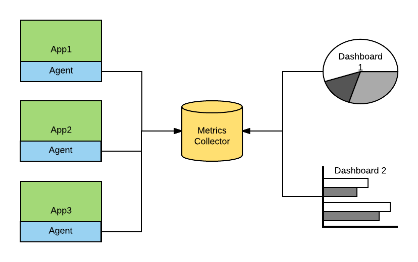
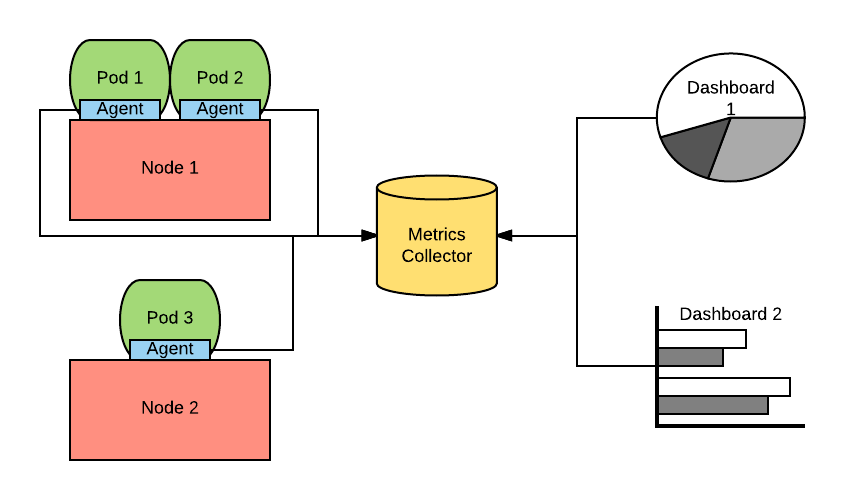
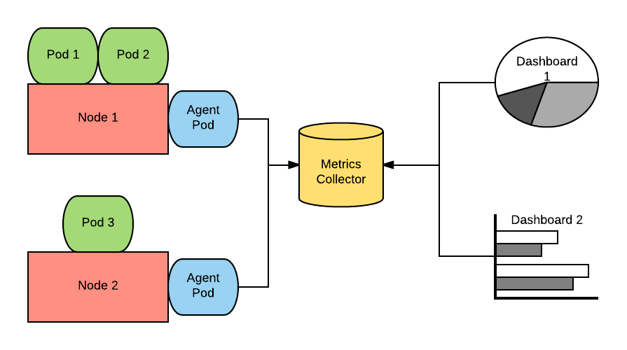

---
---
= APM Guidance
Raffaele Spazzoli <rspazzol@redhat.com>
v1.0, 2017-12-03
:toc: macro
:toc-title:

include::../../_includes/variables.adoc[]
toc::[]

== Introduction

The objective of this guidance document is to educate the reader on the https://en.wikipedia.org/wiki/Application_performance_management[Application Performance Monitoring] (APM) space. The goal is to provide enough material to have an informed conversation about it, to be able to select a product, and start a high level implementation design.

== Application Monitoring

There are several angles with which one can approach application monitoring, but all of them rely on the application being observable. The three main sources of information that make an application observable are the following (there is a much longer discussion https://medium.com/@copyconstruct/monitoring-in-the-time-of-cloud-native-c87c7a5bfa3e?__s=bwykwk1kcceogszq8abt[here]):

|===
|*Observable*|*Description*

|Application logs|Contains the state of the app as well as actions being undertaken.
|Application metrics|Contains various metrics about the technology stacks in which the app is running, as well as some app specific metrics, if the app has been instrumented.
|Tracing|Contains information about how time is spent during the processing of a request.
|===

Using these source of information we can build the following types of application monitoring:

|===
|*Type of Monitoring*|*Description*

|Application liveness|Determines whether the application is alive and responding appropriately. Used to set off alerts and start automatic recovery procedures.
|Application SLA|Determines whether the application is responding with the agreed SLAs. Sometimes this involves an external service that can generate requests from multiple geographies and accounts for lags introduced by going through the internet.
|Application Performance Monitoring|Provides introspection to the inner working of the application. Generates a series of statistics on the general status of the runtime (memory used, threads, methods called etc…). Can also be used to profile the application and find internal bottlenecks.
|Distributed Tracing|Provides visibility on how time is spent when processing a request. This particularly useful in a microservices architecture in which requests are processed by several microservices.
|Business Activity Monitoring|Provides visibility on business key performance indicators (KPIs) that are influenced by the given application. Can be used to create alerts in situations where the application is performing fine from a technical perspective (or example: app is up and running and SLAs are honored) but not performing from a business perspective (for example: checks are not being processed).
|===

And the list can probably be longer.

In this document we will be focusing on Application Performance Monitoring (APM) and Distributed Tracing and what changes in these spaces with the introduction of https://en.wikipedia.org/wiki/Container_Linux_by_CoreOS[containers] and https://en.wikipedia.org/wiki/Microservices[microservices] architectures.

== Application Performance Monitoring

Application Performance Monitoring is about being able to answer these types of questions:

 * Why did the container blow up?
 * Why am I running out of memory?
 * Why is this use case taking so long to execute?
 * Why am I running out of JDBC connections?

APM is nowadays achieved by instrumenting the application so that it can generate metrics about what is going on inside the process running it and collecting those metrics to some central database that can then be used to generate dashboards and do alerting.

Normally an application is instrumented by adding a probe that captures the main application events and metrics. In Java this is done via an agent (activated usually with the https://docs.oracle.com/javase/8/docs/technotes/tools/windows/java.html#BABDJJFI[CLI argument ]). Other runtimes may have different approaches.

In the container world there are two ways of installing APM tools.

=== Agent included in the container image

In this architecture the container image of the application that needs to be monitored has the agent onboard. Upon start of the container, the agent will be activated and start communicating with the metrics collector.

Notice that this approach requires specifically crafted images and decreases the ability to reuse externally prepared images such as the {docs_url}creating_images/s2i.html[s2i images] from Red Hat.

==== Prometheus instrumentation

https://prometheus.io/[Prometheus] is becoming a very popular metrics collector and going forward will be officially supported in OpenShift for collecting infrastructure-related metrics. A possible approach to APM is to have Prometheus also collect application metrics.

https://projects.spring.io/spring-boot/[Spring Boot] can expose metrics directly via the https://docs.spring.io/spring-boot/docs/current/reference/htmlsingle/#production-ready[Actuator library]. Integrations between Actuator and Prometheus exist in the open source space, for example https://github.com/moelholm/prometheus-spring-boot-starter[here].

Prometheus has the ability to automatically start scraping pods with some specific annotations.  +
So the setup for this configuration is very minimal. On the other hand, Prometheus does not currently offer a APM-specific dashboard.

=== Agent deployed as a daemon set

In this approach the agents are deployed as {docs_url}dev_guide/daemonsets.html[daemon sets]. The containers in this daemon set are privileged and can inspect the other containers running on the same node. Once a new container starts, the agent sends all available information of that container to the metrics collector.

Note that in this case very little additional work is required in order to enable APM and that no additional image configuration is needed.

=== Market players

Major market players in APM are:

 * https://www.dynatrace.com/[Dynatrace]
 * https://www.appdynamics.com/[AppDynamics]
 * https://newrelic.com/[New Relic]

For more information about the APM tools landscape see Gartner’s “Magic Quadrant” report on APM tools (document code https://www.gartner.com/document/3551918?ref=exploremq[G00298377]), available through the Gartner site.

It is important to be aware that there is a trend for pure infrastructure monitoring tools to invade the APM space and for APM tools to invade the infrastructure space. In fact a new generation of tools try to do both. Some examples are:

 * https://sysdig.com/[Sysdig]
 * https://www.instana.com/[Instana]

When choosing a product, you may want to consider whether it is part of the https://hub.openshift.com/primed[OpenShift Primed list].

Below we have a series of link to help getting started with each of the mentioned products.

==== Installing Dynatrace on OpenShift

https://www.dynatrace.com/technologies/cloud-and-microservices/openshift-monitoring/[https://www.dynatrace.com/technologies/cloud-and-microservices/openshift-monitoring/] +
https://www.dynatrace.com/partners/technology-partners/redhat/[https://www.dynatrace.com/partners/technology-partners/redhat/] +
https://blog.openshift.com/author/dynatrace/[https://blog.openshift.com/author/dynatrace/]

==== Installing AppDynamics on OpenShift

https://blog.appdynamics.com/product/using-appdynamics-with-red-hat-openshift-v3/[https://blog.appdynamics.com/product/using-appdynamics-with-red-hat-openshift-v3/] +
https://www.appdynamics.com/solutions/cloud-monitoring/openshift/[https://www.appdynamics.com/solutions/cloud-monitoring/openshift/] +
https://blog.openshift.com/appdynamics-integration-with-openshift/[https://blog.openshift.com/appdynamics-integration-with-openshift/]

==== Installing New Relic on OpenShift

https://blog.openshift.com/using-new-relic-to-monitor-applications-on-openshift/[https://blog.openshift.com/using-new-relic-to-monitor-applications-on-openshift/]

==== Installing Sysdig on OpenShift

https://sysdig.com/openshift-monitoring/[https://sysdig.com/openshift-monitoring/] +
https://support.sysdig.com/hc/en-us/articles/211421063-Sysdig-Install-OpenShift[https://support.sysdig.com/hc/en-us/articles/211421063-Sysdig-Install-OpenShift] +
https://blog.openshift.com/openshift-ecosystem-using-sysdig-monitor-openshift/[https://blog.openshift.com/openshift-ecosystem-using-sysdig-monitor-openshift/]

==== Installing Instana on OpenShift

https://blog.openshift.com/deploying-instana-apm-natively-openshift-environment/[https://blog.openshift.com/deploying-instana-apm-natively-openshift-environment/] +

== Distributed Tracing

Distributed tracing is about understanding how time is spent between all of the hops a request goes through in order to be completed. Distributed tracing is not new but it becomes more relevant in a microservices architecture as the average number of hops per request increases.

The current distributed tracing standard is http://opentracing.io/[OpenTracing], which has been https://www.cncf.io/blog/2016/10/11/opentracing-joins-the-cloud-native-computing-foundation/[recently accepted] by the https://www.cncf.io/[CNCF] (thus is likely to be widely embraced).

The reference implementation of OpenTracing is https://github.com/jaegertracing/jaeger[Jaeger] (also part of CNCF).

The general architecture of Jaeger is the following:

image::images/jaeger_architecture.png[]

A jaeger client (http://jaeger.readthedocs.io/en/latest/client_libraries/[client libraries] for various languages exist) will generate trace information and sends them via a local UDP to a jaeger agent, running as a http://blog.kubernetes.io/2015/06/the-distributed-system-toolkit-patterns.html[sidecar]. The jaeger agent will perform the necessary sampling and throttling, and then send the traces to the central jaeger collector, which stores them in http://cassandra.apache.org/[Cassandra]. Once the traces are stored they can be visualized using the UI.

Instructions on how to install jaeger in OpenShift can be found https://github.com/jaegertracing/jaeger-openshift[here].

The UI presents result as follows:

image::images/jaeger_ui.png[]

https://github.com/redhat-helloworld-msa/helloworld-msa[Helloworld-MSA] is an example of how to instrument an application with Jaeger.

If you are building a http://blog.christianposta.com/microservices/application-network-functions-with-esbs-api-management-and-now-service-mesh/[service mesh] with https://istio.io/[istio], consider that istio is naturally integrated with jaeger, as explained https://istio.io/docs/tasks/telemetry/distributed-tracing.html[here].
