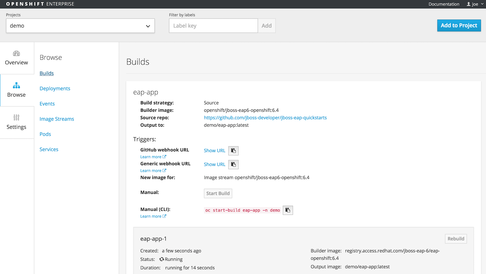

---
---
= Builds
Andrew Block <ablock@redhat.com>
v1.0, 2015-09-15
:toc: macro
:toc-title:

toc::[]
[quote, OpenShift Builds, https://docs.openshift.com/enterprise/3.0/architecture/core_concepts/builds_and_image_streams.html#builds]
_________________________________________________
A build is the process of transforming input parameters into a resulting object
_________________________________________________

A build configuration is defined by a BuildConfig object. The parameters are used in conjunction with a strategy to assemble a Docker image which in turn will be run within a container. In most cases, a *builder* is used to produce the resulting image. The use of a builder depends on the type of build strategy specified

Key Components:

* Build Strategy
* Build Types
* Triggers

== Build Strategies

The following build strategies are available in OpenShift V3:

* Docker
* S2I
* Custom Build

=== Docker Build

One of most popular methods of creating a Docker image is to utilize a Dockerfile. This allows for a new image to be built on top of an existing base image with additional layers created from directives within the Dockerfile

==== Dockerfile Example

The following example demonstrates how a Dockerfile is used to build an image containing a sample website running Apache https

[source]
----
FROM fedora <1>
MAINTAINER John Doe email: jdoe@redhat.com <2>

# Update the image with the latest packages (recommended)
RUN yum update -y; yum clean all <3>

# Install Apache Web Server
RUN yum install -y httpd; yum clean all

# Add the tar file of the web site
ADD mysite.tar /tmp/ <4>

# Docker automatically extracted. So move files to web directory
RUN mv /tmp/mysite/* /var/www/html

EXPOSE 80 <5>

ENTRYPOINT [ "/usr/sbin/httpd" ] <6>
CMD [ "-D", "FOREGROUND" ] <7>

----
<1> Base image the new image will be built from
<2> The creator
<3> Commands to execute during the image build
<4> Files are added to the image from the host
<5> Associates a port inside the container to enable networking
<6> Set the default application that is used every time a container is created using the image
<7> In this case, it is arguments that are passed to the default application. Without `Entrypoint`, it is the default command that is run when starting the container

A Docker build in OpenShift is similar to a Docker build in a standalone environment.

* An ImageStream containing a reference to a Docker image and/or a location containing a Dockerfile must be specified
* New Docker images are created by reading instructions from a Dockerfile.

==== Additional Resources
* https://docs.docker.com/reference/builder/[Dockerfile]
** https://docs.docker.com/articles/dockerfile_best-practices/[Dockerfile Best Practices]

Docker Build in a BuildConfig
The following is a snippet of code demonstrating the use of a Docker build in a BuildConfig

[source]
----
 {
  "kind": "BuildConfig",
  "apiVersion": "v1",
  "metadata": {
    "name": "openldap",
    "creationTimestamp": null,
    "labels": {
      "name": "openldap"
    }
  },
  "spec": {
    "source": {
      "type": "Git",
      "git": {
        "uri": "git://github.com/openshift/origin.git", <1>
        "ref": "master" <2>
      },
      "contextDir": "images/openldap" <3>
    },
    "strategy": {
      "type": "Docker",
      "dockerStrategy": {
        "from": {
          "kind": "ImageStreamTag", <4>
          "name": "openldap:latest"
        }
      }
    },
    "output": {
      "to": {
        "kind": "ImageStreamTag",
        "name": "openldap-testenv:latest" <5>
      }
    },
    "resources": {}
  },
  "status": {
    "lastVersion": 0
  }
}
----
<1> Source repository
<2> Branch of repository to utilize
<3> Directory in repository containing Dockerfile
<4> Specifies the base image the build is utilizing. Can be use to track against changes to trigger a rebuild of the application if configured
<5> After the Docker image is successfully built, it will be pushed into the repository described

==== Benefits

* Easily deploy already existing images into OpenShift
* Take advantage of OpenShift concepts such as ImageStreams for determining when base image changes

==== Limitations
* Dockerfiles are static
** Environment variables cannot be injected

== Source to Image (S2I)

[quote, S2I Requirements, https://docs.openshift.com/enterprise/3.0/creating_images/s2i.html]
_________________________________________________
Source-to-Image (S2I) is a framework that makes it easy to write images that take application source code as an input and produce a new image that runs the assembled application as output.
_________________________________________________

*Note:* Source to Image was initially abbreviated STI but was renamed S2I prior to the general availability release of OSE.

=== S2I process deep drive

image::https://raw.githubusercontent.com/openshift/source-to-image/master/docs/sti-flow.png[S2I Flow]

=== S2I Scripts

The following table provides an overview of the S2I scripts that are executed within the builder image:

.S2I Scripts
|===
| Name | Description | Notes

|*assemble*
|Builds the application artifact from source and places them into the directory within the image
|required

|*run*
|Executes the application
|required

|*save-artifacts*
|Gathers any artifacts that could be reused in subsequent builds (such as .gems [RubyGems] and .m2 [Maven])
|optional. Only invoked when the `incrementalBuild: true` option is specified in the BuildConfig

|*usage*
|Informs the user how to use the image
|optional

|*test/run*
|Allows for a simple process to be created to validate the image is working correctly
|optional
|===

*Note:* In most cases, you will be interacting with the _assemble_ and _run_ scripts.

==== Specifying S2I Scripts Location

To maximize the flexibility and extensibility of the S2I process, an S2I script can be stored either in Docker images, application source code, or in a remote location. Given the various options for defining a location for S2I scripts, there is a precedence by which S2I an script is loaded. The following details the methods in which S2I scripts can be defined and their order of precedence:

. Specifying the directory containing the script with the `scripts` option of the BuildConfig
+
[source]
----
{
  "strategy": {
    "type": "Source",
    "sourceStrategy": {
      "from": {
        "kind": "ImageStreamTag",
        "name": "builder-image:latest"
      },
      "scripts": "http://somehost.com/scripts_directory"
    }
  }
}
----
. Script found in the `.sti/bin` directory of the application source
. Script found at the default image URL ([red]#io.openshift.s2i.scripts-url# label)

Both the [Red]#io.openshift.s2i.scripts-url# label specified in the image and the _scripts_ BuildConfig definition can take one of the following forms:

* [Red]#image://path_to_scripts_dir# - absolute path inside the image to a directory where the S2I scripts are located

* [Red]#\file://path_to_scripts_dir# - relative or absolute path to a directory on the host where the S2I scripts are located

* [Red]#http(s)://path_to_scripts_dir# - URL to a directory where the S2I scripts are located

==== Injecting Environment Variables

Values can be injected into S2I scripts to enable dynamic configuration for a particular OpenShift environment using two methods:

* Environment File - File called `.sti/environment` within the application source code
* BuildConfig definition - Environment variables can be specified within the strategy section of a BuildConfig definition. The following example illustrates the usage within a BuildConfig definition:

[source]
----
{
  "kind":"BuildConfig",
  "apiVersion":"v1",
  "metadata":{
    "name":"test",
    "labels":{
      "name":"test"
    }
  },
  "spec":{
    "triggers":[],
    "source":{
      "type":"Git",
      "git":{
        "uri":"https://github.com/openshift/origin"
      },
      "contextDir":"test/extended/fixtures/test-build-app"
    },
    "strategy":{
      "type":"Source",
      "env": [
        {
          "name": "BUILD_LOGLEVEL",
          "value": "5"
        }
      ],
      "sourceStrategy":{
        "from":{
          "kind":"DockerImage",
          "name":"openshift/ruby-20-centos7"
        }
      }
    },
    "output":{
      "to":{
        "kind":"ImageStreamTag",
        "name":"test:latest"
      }
    }
  }
}
----

Several of the builder images utilize environment variable to drive their execution. Examples include setting the location of a proxy server using the `HTTP_PROXY` variable or to set Maven arguments using the `MAVEN_ARGS` variable.

===== Additional Resources
* https://docs.openshift.com/enterprise/3.0/creating_images/s2i.html#s2i-scripts[S2I Scripts]

==== S2I within Applications

Applications that are built by an S2I image can override the default scripts provided in the builder image if desired

* Overriding scripts
** BuildConfig definition
** Environment variables

==== Existing builder images

The following S2I builder images are available in the OpenShift ecosystem

* JBoss EAP/EWS
* Python
* Node
* PHP
* Perl
* Ruby
* ...

==== JBoss EAP Integration

The JBoss EAP image for OpenShift includes S2I scripts located in the `/usr/local/s2i` directory. These are run by default if the application being built does not include any of the S2I scripts.

The best way to learn how the JBoss S2I builder works is to investigate the builder itself. Run the following command to start a container containing the builder image

   docker run -it --rm --entrypoint=/bin/bash registry.access.redhat.com/jboss-eap-6/eap-openshift

*Note:* the `--entrypoint` option is used to override the default functionality to start the JBoss server

Areas to explore:

* Environment variables
* S2I Scripts
* Scripts use to start JBoss
* JBoss Platform

===== Custom configurations

Custom JBoss configurations and modules can be added to your application which will be automatically configured in the resulting image.

*Configurations* - Configuration files, such as the JBoss _standalone.xml_, can be placed in a folder called _configuration_ in the application source

*Modules* - Modules can be placed in a _modules_ folder within the application source. They are recursively copied to the JBoss modules folder

=== S2I Development

There are a number of existing S2I builders that you can look to leverage for your application. You can also choose to create your own S2I builder to be able to leverage the benefits of S2I, but to also customize the process for your particular implementation

* https://github.com/openshift/source-to-image/blob/master/README.md#installation[Installation]
* https://github.com/openshift/source-to-image/blob/master/docs/cli.md[CLI]
* https://docs.openshift.com/enterprise/3.0/creating_images/s2i_testing.html[Testing]
* https://blog.openshift.com/create-s2i-builder-image/[Creating an S2I Builder Image]

=== Binary deployments

In certain cases, an application may be previously compiled outside of an OpenShift build. There are two methods to include an existing binary artifact(s) in the resulting image:

1. Customize the _assemble_ script as part of the S2I build process to retrieve a previously packaged artifact from a remote source (such as an artifact repository) and place in the JBoss deployments folder.
2. Place prepackaged jar, war, or ear in a folder called *deployments* at the root of repository. These files will be automatically copied to the JBoss deployments folder. 

The following is an example of a deployment of a binary application for the OpenShift JBoss EAP image using a customized _assemble_ script

[source, bash]
----
#!/bin/bash

# Download and place binary in JBoss. WAR_FILE_URL variable is specified as an environment variable in the BuildConfig
curl -o $JBOSS_HOME/standalone/deployments/ROOT.war -O ${WAR_FILE_URL}

# Call default assemble script
/usr/local/sti/assemble

----

The location where this script is found can be included in the _BuildConfig_ in one of two methods:

* In a `.sti/bin` folder within separate git repository
* A directory containing S2I scripts defined by the `scripts` attribute

== Custom Build

A custom build allows for the creation of a custom builder image which can be used to control the entire build process. A custom builder image is a plain Docker image centered around a _Dockerfile_ that utilizes scripts containing custom build process logic. This customized logic can include building RPM's, running CI/CD scenarios or producing images.

NOTE: The `openshift/origin-custom-docker-builder` is used by default to execute the build. The image contains a script located at `/tmp/build.sh` to perform the build actions which is executed when the image is run. Inspecting this script will help you understand the overall build process from retrieving source code to pushing to Docker repositories.

=== Custom Build in a BuildConfig

The following is a snippet of code demonstrating the use of a BuildConfig

[source]
----
{
    "kind": "BuildConfig",
    "apiVersion": "v1",
    "metadata": {
        "name": "ruby-sample-build",
        "creationTimestamp": null,
        "labels": {
            "name": "ruby-sample-build"
        }
    },
    "spec": {
        "triggers": [],
        "source": {
            "type": "Git",
            "git": {
		"uri": "https://github.com/openshift/ruby-hello-world.git" <1>
            }
        },
        "strategy": {
            "type": "Custom",
            "customStrategy": {
		"from": {
		    "kind": "DockerImage",
		    "name": "docker.io/openshift/origin-custom-docker-builder"
		},
		"env": [
		    {
			"name": "OPENSHIFT_CUSTOM_BUILD_BASE_IMAGE",
			"value": "docker.io/openshift/origin-custom-docker-builder"
		    }
		],
		"exposeDockerSocket": true, <2>
		"forcePull":true
            }
        }
    }
}

----

<1> Specifies the source repository that will be injected into the build
<2> Allows the Docker socket to be available inside the builder. Essential when the builder is use to build and push new Docker images

== Build Types

Depending on the build strategy, one or more of the following types can be applied:

* Git
* Dockerfile
* Binary

=== Git

Source code is retrieved from a Git based repository

=== Dockerfile

An inline dockerfile can be specified within the *BuildConfig* object

[source]
----
{
 "source" : {
    "type" : "Dockerfile",
    "dockerfile": "FROM centos:7\nRUN yum install -y httpd"
 },
}

----

=== Binary

Unlike the other build strategies and types, a binary source is an interactive build where a binary artifact is provided when starting a new build using the `oc start-build` command. A binary artifact can be a single file if the *asFile* field is specified, similar to the following:

[source]
----
{
 "source" : {
    "type" : "Binary",
    "binary": {
      "asFile": "webapp.war"
    },
 }
}

----

Otherwise, it is expected that the content received by the builder will be a compressed archive containing a directory structure that will be extracted at the start of a build.

Two options are available by the `oc start-build` command that directly relates to Binary builds.

* `--from-file` - The location of a single file that will be used as the binary content
* `--from-directory` - Directory that will be archived and supplied as binary content

==== Usage with JBoss Applications and S2I Builds

As described in the <<Binary deployments>> section, artifacts located in the *deployments* folder of the build context will be automatically copied to the JBoss deployments folder. This provides the ability to easily deploy JBoss artifacts with ease. 

Assuming there is existing artifact (war, ear etc), the following folder structure could be created as binary content:

[source]
----
-- ose
---- deployments
------ ROOT.war

----

Start a build specifying the location of the newly created folder structure

`oc --start-build <build_name> --from-dir=<path_to_directory>`

The folder will be zipped, streamed into the builder and extracted.

== Triggers

Triggers are a methods you can define that controls the circumstances in which a BuildConfig should be run. The following options are available:

* GitHub Webhooks
** Handles a call made from a GitHub repository
* Generic Webhooks
** Handles a call made from any system capable of making a web request
* ImageChange
** New build initiated when an upstream image is available
* Configuration Change
** New build initiated when the BuildConfig is modified

[source]
----
{
  "type": "GitHub",
  "github": {
    "secret": "secret101"
  }
},
{
  "type": "Generic",
  "generic": {
    "secret": "secret101"
  }
},
{
  "kind": "ImageStream",
  "apiVersion": "v1",
  "metadata": {
    "name": "ruby-20-centos7"
  }
},
{
  "type": "ConfigChange"
}

----

*_Secret's_* are used to ensure only authorized users are able to utilize the webhook

== Determining a Build Strategy

While OpenShift provides several methods for producing a resulting image, it may be difficult to decide which build strategy to choose. The following following table provides typical use cases for each type of build strategy:

[cols="1,2a"]
|===
| Strategy | Usage

|Docker
|
* Existing Dockerfiles present (Community origin, custom)
* Static images (ones that change infrequently)

|S2I
|
* Layer application code on existing images
* Reuse artifacts from previous builds
* Use existing S2I builders
* Ability to test builder executions

|Custom
|
* Existing builders do not provide the functionality to produce the appropriate resulting image.
* Custom testing logic associated within a CI process
|===

== Managing Source Code

OpenShift has the ability to obtain the source code from a source code management (SCM) system. Currently, OpenShift supports only _Git_ source types

=== Using a Proxy

If a proxy server is required to access the source code from an application, the `httpProxy` and/or `httpsProxy` can be specified in the in the BuildConfig.

The following is an example of how to define a proxy server to mediate requests to a endpoint git repository

[source]
----
"source": {
  "type": "Git",
  "git": {
    "uri": "https://github.com/openshift/ruby-hello-world.git",
    "httpProxy"  : "http://someproxy.com",
    "httpsProxy" : "https://someproxy.com"
  }
}
----

== Build Management

Builds can be managed from both the OpenShift web console and the CLI

=== CLI Commands

* Get all Builds

`oc get builds`

* Create a new build configuration

`oc new-build (IMAGE | IMAGESTREAM | PATH | URL ...) [options]`

* Start Build

`oc start-build (BUILDCONFIG | --from-build=BUILD) [options]`

* Cancel Running Builds

`oc cancel-build BUILD [options]`

Consult the help option of each subcommand for additional information and usage

==== Comparisons with OpenShift 2 Build process

The build process in OpenShift V3 is slightly different than in OpenShift V2. The following table defines some of the differences between the two versions:

|===
| Name | OpenShift V2 | OpenShift V3

|*Source Code*
|Resides in the gear and utilized at build time
|Externally hosted and pulled as part of the build

|*Environment Variables*
|Set of default variables defined within the cartridge and gear. Environment variables can also be added to the application in the `.openshift/action_hooks/build` script, using the `rhc` command line tool using `rhc env set <variable>=<value>`
|Set in the _BuildConfig_ definition or added to an application in a `.sti/environment` file

|*Build scripts*
|Combination of scripts defined within each cartridge and user scripts defined in the `.openshift/action_hooks` directory in an application
|Depends on the build strategy. S2I defines a set of scripts that be defined either in the builder image, application or externally sourced and defined in the BuildConfig definition.

|*Application Environment*
|Build executes within the gear to produce a deployable in the gear
|Build executes using a builder. The result of the builder will push an image to a Docker registry
|===

== Web Console

Builds can also be managed in the OpenShift web console by navigating to a project and selecting the *Builds* link

