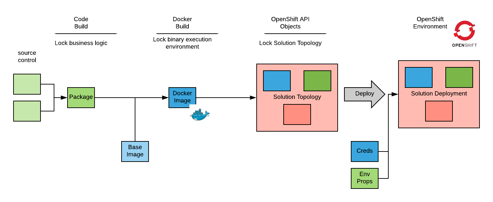
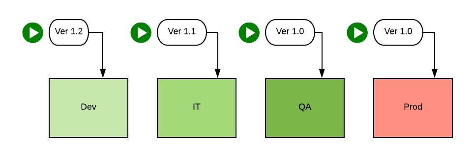
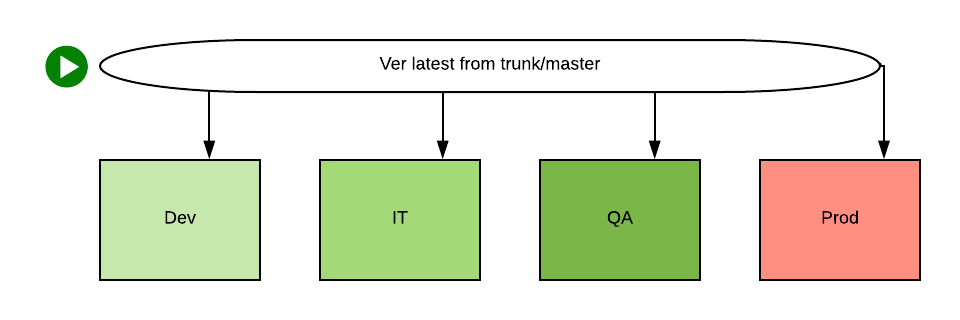
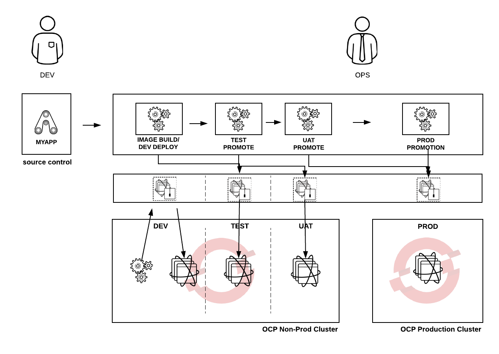
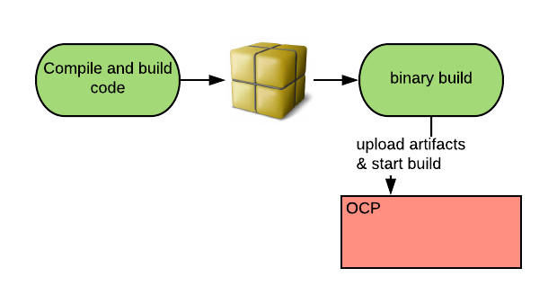
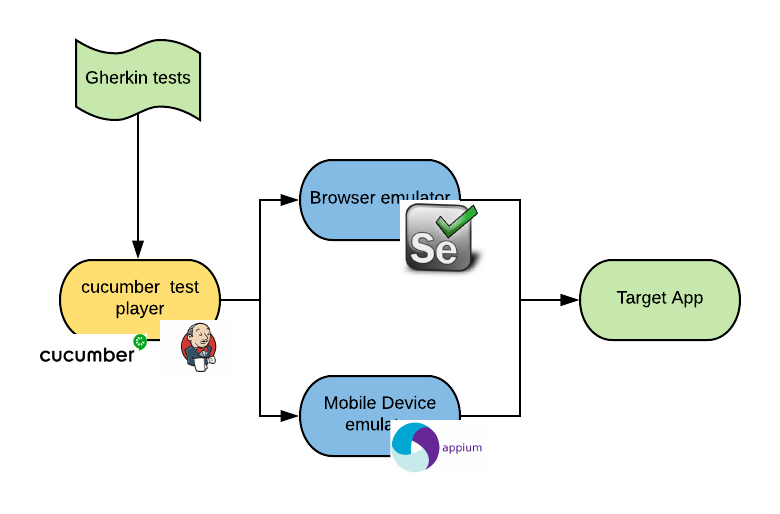

---
---
= Elements of an OpenShift CI/CD  Pipeline
Raffaele Spazzoli <rspazzol@redhat.com>
v1.0, 2018-4-23
:scripts_repo: https://github.com/rhtconsulting/rhc-ose
:toc: macro
:toc-title:

include::../../_includes/variables.adoc[]
toc::[]

This document’s objective is to explain some foundational concepts related to building a CI/CD pipeline and how they relate to OpenShift. This is intended to be an introductory guide to what is in fact a rather vast topic. More in-depth and implementation-oriented guidelines are linked from this document when appropriate. 

== Immutable infrastructure

The general concept of immutable infrastructure is that there is only one way to introduce change into a system, and that way is to destroy and recreate that system. +
The main benefit of this approach is that changes are introduced in a very controlled way, minimizing drifts and misconfiguration. In addition, having a single method for introducing change allows more focus on automation and optimization.
https://en.wikipedia.org/wiki/Infrastructure_as_Code[Infrastructure as code] is a common apporach used to achieve immutable infrastructure (this topic is out of scope for this document).  

Systems and infrastructure can be rapidly destroyed and recreated. Therefore, immutability should not be interpreted as rigidity, but rather as a very prescriptive rule about how change can be introduced. For the lifetime of a given instance of a system, it is actually immutable. 

The concept of immutable infrastructure can be applied to container-based solutions and deployment pipelines with the idea of progressively locking the infrastructure:

Pieces of the infrastructure are locked down in different phases and each infrastructure piece becomes immutable after being locked down.

The *Code Build phase* locks the business logic. This is about creating a deployable artifact starting from our code. We have always done this step. +
The *Image Build phase* locks the binary execution environment and creates a container image. After the container image is created, the business logic can be executed anywhere with no drift (for binaries and other runtime dependencies). +
The *Topology Definition phase* locks the topology of the solution. Assuming the deployment involves a solution comprised of several components, this phase creates and locks the topology that describes which components must be deployed and their dependencies. The declarative API is leveraged to create a manifest of the compute, networking, and storage resources that are needed.

Notice that we have already locked down most of the infrastructure and we haven’t deployed anything yet.

The last phase performs the deployment to an environment. During deployment,  environment-dependent properties are injected, including public properties as well as confidential credentials.

To comply with the principle of immutable infrastructure after deployment, the only way to introduce new change in the environment is to repeat the previous processes. This is true regardless of the nature of the change that we want to introduce, which might include:

* Code release
* Runtime updates
* Security Patches
* Configuration changes

In traditional environments, the last three items are usually the responsibility of the operations team, and the developer team is not necessarily involved when they are performed. With immutable infrastructure and containers, deployment processes need to be radically rethought and need to involve the developer teams.

The phases of the progressing locking process that we have described can implemented in a CI/CD pipeline. The following sections discuss the types of pipelines and the types of steps that are part of a pipeline.

== Types of pipelines

Release management processes typically feature automated deployment procedures. An authorized user selects a software version and an environment, and then initiates the release process. 

If the promotion workflow from the development environment to the production environment is a series of manually triggered deployments, this is referred to as a *point and click* pipeline.

The more modern *straight through* pipeline takes code from version control system (VCS) and promotes it through the various environments to production with minimal or no human intervention.

A straight through pipeline is generally preferred because it minimizes human error, but it requires a higher level of organization maturity.

There is a continuum between strict point and click pipelines and straight through pipelines and each organization must determine the type of deployment pipeline that will fit their environment.

== Ownership of the pipeline

It is important to identify who in the organization owns the release process, tools, and pipelines. For traditional https://en.wikipedia.org/wiki/ITIL[ITIL-based] organizations, there is typically a release management team that owns the release process. That team might also own the tools involved in supporting the pipelines, and, in some cases,  own the actual pipelines.

Ownership should be clearly defined for all pipeline-related aspects:

* Release policies and compliance rules
* Templates and other general reusable pipeline artifacts
* Tools needed to support the pipeline
* Individual pipelines

The current trend for agile organizations is to have developer teams own the pipelines for their specific applications. In this case, the development teams are responsible for creating and updating the pipelines, as well as ensuring pipeline compliance with enterprise-issued release management standards.

Because pipeline processes can be described *as code*, developers must learn the pipeline https://en.wikipedia.org/wiki/Domain-specific_language[Domain Specific Language] (DSL), but otherwise have a short learning curve.

More traditional organizations are instead not comfortable with this approach because they want to have a clear separation of duty between development activities and deployment tasks.

Each organization is different and will have to determine their own ownership model for pipelines.

== Types of pipeline steps

Typically, there are four steps in a pipeline:

|===
|*Step Type*|*Description*

|Build|Creates or builds artifacts used by other steps.
|Promotion|Deploys artifacts created in a build step to a specified environment.
|Validation|Validates actions performed in a previous step, typically  build or deploy. If the validation step fails, the pipeline process might be aborted.
|Compliance |These type of steps are sometimes needed to make the pipeline compliant with enterprise release management standards.
|===

NOTE: Because the primary task of a pipeline is to promote software through various https://en.wikipedia.org/wiki/Systems_development_life_cycle[Software Development Lifecycle] (SDLC) environments to production, an https://en.wikipedia.org/wiki/Minimum_viable_product[MVP] (Minimum Viable Product) pipeline only requires Build and Promotion steps.

The recommended approach is to create an MVP pipeline, and only add validation and compliance steps after the MVP pipeline is verified.

=== Build steps

Build steps include everything needed to build a container image. Although version control is always in effect for container images, it might also be required for other deployment artifacts (for example, jar files) for compliance reasons. The pipeline owner must work with the release policies owner to ensure compliance requirements are met.

There are three ways to build a docker image:

|===
|*Build type*|*Description*

|External Docker build|Performs a standard Dockerfile build external to the OpenShift cluster. In this case, OpenShift is independent of the build.
|link:{docs_url}dev_guide/builds/build_strategies.html#docker-strategy-options[Internal Docker build^]|Performs a standard Dockerfile build executed as a pod inside of OpenShift.
|link:{docs_url}architecture/core_concepts/builds_and_image_streams.html#source-build[S2I build^]|Performs a source to image build that includes intermediate artifacts and docker image and that is executed as one process inside a pod.
|===
Each of these build types produces the desired output, but has different advantages and disadvantages. Because builds are spiky types of workload, Internal Docker Builds are well-suited for container platforms in which capacity is given back to the pool at the end of the build. Running builds inside of OpenShift can increase overall environment efficiency. However, running builds internally in OpenShift creates garbage that needs to be removed (see this sections of the doc on https://docs.openshift.com/container-platform/3.9/admin_guide/garbage_collection.html[garbage collection]. 

The main advantage of S2I builds is that they don’t require learning Dockerfile syntax. Building good docker images is an acquired skill and it may not be worth the cost of training all the developers in an organization. Another advantage is that the build steps in a S2I build are not run with root privileges. On the other hand, because S2I builds are not part of the Kubernetes API, S2I builds are not portable across  Kubernetes-based platforms. In addition, although it is possible to https://docs.openshift.com/container-platform/3.7/creating_images/s2i.html[customize the S2I process], learning to customize S2I builds can be as time consuming and complex as learning how to properly build docker images.

More information for these build types can be found in the field playbook located link:../app_dev/builds.html[here^].

==== Binary builds

If  a build process already exists and the objective is to customize it to deploy to OpenShift, the link:{docs_url}dev_guide/builds/build_inputs.html#binary-source[binary build^] is a good option. The binary build uses artifacts produced in a previous step as input to an OpenShift build (either docker or S2I).

==== Jenkins pipeline build strategy 

A recent addition to the set of available OpenShift build types is the link:{docs_url}dev_guide/builds/build_strategies.html#pipeline-strategy-options[Jenkins pipeline build strategy]. A Jenkins pipeline build is a build strategy that includes a mechanism to trigger a Jenkins build from within OpenShift via an API call. The build logic resides in Jenkins. 

=== Promotion steps

Promotion steps are used to deploy solutions (comprised of multiple components) to SDLC environments. In OpenShift, an environment is a project residing in a cluster. +
Assuming there is an existing OpenShift template that represents the solution, the deployment is performed with the following command:

[source,bash]
----
oc process <template> ... | oc apply -f -
----

This command will instantiate the template to the target environment using the environment dependent template parameters (not to be confused with the environment dependent properties) and applies it to OpenShift. 

The `apply` command determines if there are differences between the current state and the new, desired state, and if so, applies the differences as patches to the existing API objects. Because existing objects are not destroyed, the related applications do not incur outages.

If triggers are active at this point, a new deployment commences. In general,  automatic triggers for deployments should be carefully considered. In fact if we have a pipeline orchestrator ( such as Jenkins) the logic to trigger a rollout should reside in the orchestrator.

==== Rollout strategies

The following rollout strategies are possible:

|===
|*Rollout strategy*|*Managed by*|*Description*

|Recreate|OpenShift|Destroys and recreates pods, causing outages.
|Rolling|OpenShift|Gradually creates new pods and destroys old ones in such a way to avoid outages.
|Blue/Green|Pipeline|Maintains two sets of pods (old and new) and splits traffic between the two sets, gradually moving more and more traffic to the new pods.
|Canary|Pipeline|Sends a small amount of traffic to the new pods. Once the new version is validated, works as blue/green.
|A/B (*)|Pipeline + http://blog.christianposta.com/microservices/application-network-functions-with-esbs-api-management-and-now-service-mesh/[Service Mesh]|Sends traffic to one version or the other based on some content in the request.
|Shadow|Pipeline + Service Mesh|Sends traffic to both old and new pods, traffic to new pods is managed in a way to avoid side effects. Metrics are collected, analyzed, and compared with old traffic.
|===

(*) Note: this definition of A/B testing differs from the one that you can find in the https://docs.openshift.com/container-platform/3.7/dev_guide/deployments/advanced_deployment_strategies.html#advanced-deployment-a-b-deployment[OpenShift documentation].

Deployment strategy characteristics

|===
|*Rollout strategy*|*Zero downtime*|*Real traffic testing*|*Targeted user*|*Infrastructure cost*|*Complexity*

|Recreate| no | no | no | low | low
|Rolling| yes | no | no | low | low
|Blue/Green| yes | no | no | high | medium
|Canary| yes | no | yes | low | medium
|A/B| yes | yes | yes | low | high
|Shadow| yes | yes | no | high | high
|===

=== Validation steps

Validation steps tend to be organization specific and, in part, reflect the development methodology adopted by that organization.

Validation steps can be classified as environment independent and environment dependent. To catch errors as quickly as possible, environment independent steps should be executed before the first deployment. Conversely, environment dependent steps can only be executed in an environment after the solution has been deployed. 

Examples of  environment independent and environment dependent validation steps are provided in the following tables.

Environment independent validation steps:
|===
|*Validation step*|*Common tool/technology implementations*

|Code static analysis|https://www.sonarqube.org/[SonarQube]
|Code static security scanning|https://www.veracode.com/[Veracode]
|Unit test|https://junit.org/junit5/[JUnit]
|Image security scanning |https://www.redhat.com/en/technologies/management/cloudforms[CloudForms] (with https://developers.redhat.com/blog/2016/05/02/introducing-atomic-scan-container-vulnerability-detection/[atomic scan]), https://www.twistlock.com/[Twistlock], https://www.blackducksoftware.com/[BlackDuck], https://www.aquasec.com/[Aquasec].
|===

Image security scanning is a new step introduced by container technology. It ensures the quality of images in terms of security vulnerabilities (https://en.wikipedia.org/wiki/Common_Vulnerabilities_and_Exposures[CVEs]) +
This process has two sides: on one side we need to scan the images to determine if there are known vulnerabilities in it, on the other side we need to prevent images that don’t pass the quality check from running as containers. This enforcement resides outside of the pipeline and can be configured in OpenShift via the https://docs.openshift.com/container-platform/3.7/admin_guide/image_policy.html[image admission control].  

An example image scanning pipeline step can be found https://github.com/redhat-cop/openshift-image-signing-scanning[here].

Environment dependent validation steps:

|===
|*Validation step*|*Common tool / technology implementations*

|https://en.wikipedia.org/wiki/Integration_testing[Integration test]|Various tools and techniques. https://en.wikipedia.org/wiki/Behavior-driven_development[BDD] seems to be emerging for web and mobile apps.
|https://martinfowler.com/bliki/CanaryRelease.html[Canary test]|Pipeline orchestrated and tested with integration testing tools.
|https://en.wikipedia.org/wiki/Chaos_Monkey[Chaos test]|https://www.gremlin.com/[Gremlin], https://fabric8.io/guide/chaosMonkey.html[Fabric8 Chaos Monkey].
|===

Behavioral Driven Development (BDD) testing is a valuable option and should be used for testing web and mobile applications. +
BDD test cases are created using a pseudo natural language (link:https://github.com/cucumber/cucumber/wiki/Gherkin[Gherkin^]), allowing them to be quickly and easily created by non-technical users. The test cases are translated into machine instructions at test runtime (a popular one is https://cucumber.io/[Cucumber]).  +
The general architecture of BDD tests is illustrated in the following diagram:

The above architecture can be fully deployed and contained in OpenShift. Multiple combinations of browser/operating system and mobile device/operating system tests can be executed in parallel. The advent of Windows containers will provide additional opportunities for testing applications running on Internet Explorer and Edge.

=== Compliance steps

Compliance steps may be needed when pipelines must be compliant with an organization's release process and change management.

Examples of compliance steps are provided in the following table:

|===
|*Step*|*Description*

|Manual approval|Suspends pipeline execution until manual  approval to continue is provided .
|Container image signing |Cryptographically signs images 
|Deployment manifest upload|Uploads the manifest of what is deployed to a centralized change management tool.
|===

Container image signing provides a method for making an assertion cryptographically verifiable. When an image is signed (a fact to which any meaning can be assigned, for example, the image is approved for execution ), anyone can verify that assertion. Again having assertions is only one piece of the process, the other piece, which resides outside of the pipeline, is having a way to verify and enforce them. https://github.com/redhat-cop/openshift-image-signing-scanning[Here] you can find an example of a pipeline with an container image signing step.

Google is currently working on a more general purpose assertion framework for deployment pipelines (see https://cloudplatform.googleblog.com/2017/10/introducing-grafeas-open-source-api-.html[Grapheas and Kritis]).

== Pipeline metrics and dashboards

A wealth of metrics can be collected from CI/CD pipelines, and much of the value of a pipeline is lost if metrics are not collected and made available in dashboards. DevOps teams utilize metrics for fast feedback.

Useful metrics might include: number of deployment errors  and total pipeline execution time. 

Although there are not many tools currently available for providing pipeline metrics, one example worth examining is https://github.com/capitalone/Hygieia[Hygieia] from https://developer.capitalone.com/open-source/[Capital One].

A pipeline dashboard is illustrated in the following screen capture:

image::images/hygiea-screenshot.jpg[]

== Conclusions

This article has described various deployment pipeline concepts in the context of OpenShift Container Platform and OCI containers. Immutable infrastructure and container platform automation don’t change the strategy or goals of continuous delivery but they do affect the operation of the pipeline. Definitions of pipeline phases, types, and ownership can be adjusted to leverage OpenShift behavior. Build, promotion, validation, and compliance steps can all benefit from OpenShift features designed to support CICD. And pipeline metrics and dashboards can integrate with Kubernetes to provide useful feedback on deployment automation performance. We recommend using the OpenShift automation and integration possibilities described here to enhance your deployment pipelines to provide rapid, frictionless, higher quality software releases.   

