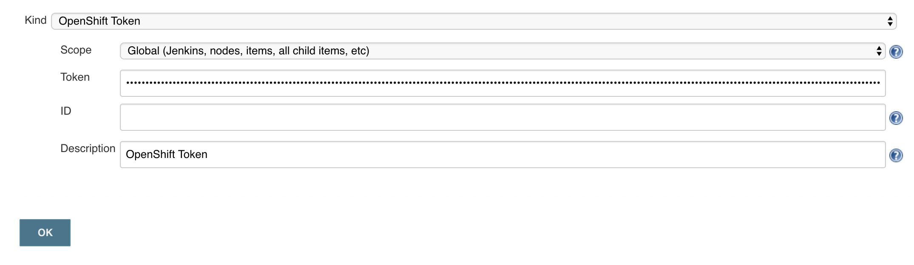
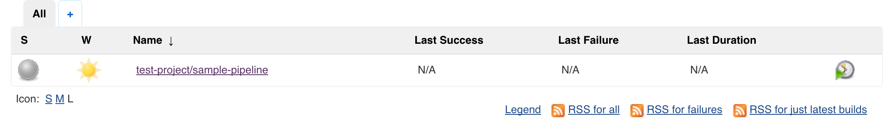
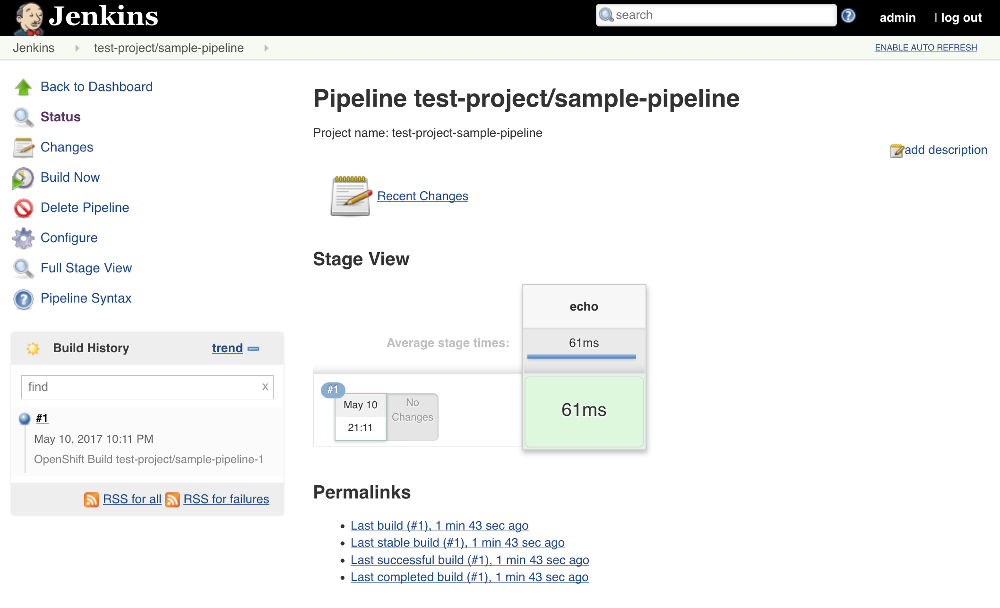
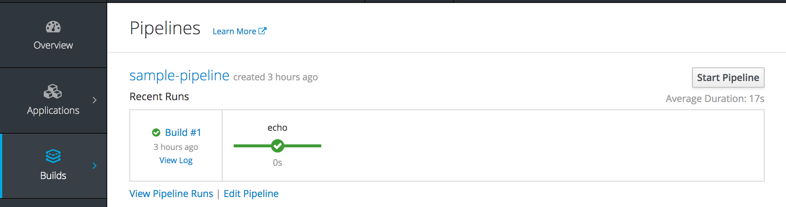

---
---
= External Jenkins Integration
Red Hat Containers & PaaS CoP
v1.0, 2017-05-10
:scripts_repo: https://github.com/rhtconsulting/rhc-ose
:toc: macro
:toc-title:

toc::[]

== Overview

The OpenShift Container Platform provides a number of features to support Continuous Integration and Continuous Delivery. Aside from its native build and deployment capabilities, OpenShift contains tight integration with the link:https://jenkins.io/[Jenkins Continuous Integration server]. Not only can users deploy supported instances within the platform, but they can take advantage of such features such as first class support for the Jenkins "pipeline as code concept" as well as leveraging dynamically allocated slave instances for the execution of Jenkins jobs. A full list of features that are provided by the provided image can be found link:https://docs.openshift.com/container-platform/latest/using_images/other_images/jenkins.html[here]. While running the entire Jenkins ecosystem within OpenShift simplifies the configuration and management of a CI environment, many organizations have an existing Jenkins environment which they would like to make use of.

This article describes the process for integrating an existing Jenkins instance located outside of the OpenShift cluster with OpenShift to be able to take advantage of many of the Jenkins related features provided by the platform.

== Requirements

The following are requirements in order to integrate an externally facing Jenkins instance into OpenShift:

* Jenkins 2.x environment
** User with administrator rights
* OpenShift Container Platform 3.3+

=== Networking

To support connectivity between OpenShift and Jenkins, the following network level access must be available:

* Jenkins must be able to communicate with the OpenShift API
* OpenShift must be able to communicate with the following Jenkins ports
** Web Port (8080 by default)
** TCP port for JNLP Agents (50000 will be used below but can be any port of your choosing)

== Plugins

The majority of the capabilities provided by the integration between OpenShift and Jenkins are made possible through a collection of Jenkins plugins.

* link:https://wiki.jenkins-ci.org/display/JENKINS/OpenShift+Pipeline+Plugin[OpenShift Pipeline] - The ability to trigger actions in OpenShift, such as starting a build or deployment. 
* link:https://wiki.jenkins-ci.org/display/JENKINS/OpenShift+Sync+Plugin[OpenShift Sync] - Synchronizing the state of Jenkins jobs and OpenShift objects (BuildConfigs) in order to facilitate integrated pipelines. 
* link:https://wiki.jenkins-ci.org/display/JENKINS/Kubernetes+Plugin[Kubernetes Plugin] - The ability to trigger actions in OpenShift, such as starting a build or deployment. 
* link:https://wiki.jenkins-ci.org/display/JENKINS/OpenShift+Client+Plugin[OpenShift Client Plugin] - Jenkins Pipeline DSL for interacting with OpenShift.

NOTE: Starting in OpenShift version 3.4, the included Jenkins image provided by the platform began to leverage the link:https://wiki.jenkins-ci.org/display/JENKINS/OpenShift+Login+Plugin[OpenShift Login Plugin]  which enabled integrated authentication between OpenShift and Jenkins. The process for configuring this plugin in an externally facing Jenkins instance will not be covered in this article 

Each of these plugins must be installed within an existing Jenkins instance. As a Jenkins user with administrator access, login to Jenkins and navigate to *Manage Jenkins* -> *Plugin Manager*. Click on the *Available* tab and search for the plugins listed above. Check the box next to each of the plugins and when complete, select *Download now and install after restart*.

==  Credentials

With the required Jenkins plugins installed, to perform many of the aforementioned actions provided by the plugins, Jenkins must be able to communicate and authenticate against OpenShift. To do so, a service account within OpenShift should be created. 

NOTE:  A service account in OpenShift makes use of a non-expiring OAuth token which is ideal for situations such as this. 

Once the service account has been created, the OAuth token will be stored as Credentials within Jenkins 

=== Service Account Creation within OpenShift

Service accounts within OpenShift are scoped to a single project. Even though Jenkins will not be running within OpenShift, it is recommended that a separate project be created to support a separation of duties within the platform and to provide a location to execute dynamic slaves as described in subsequent sections. The project name _ci_ will be used in the examples below, but you are free to select any name you wish. 

Using the OpenShift Command Line Tool (CLI), login to OpenShift as and create a new project called _ci_

----
oc login <OpenShift Master Address>
oc new-project ci
----

Create a new service account called jenkins

----
oc create serviceaccount jenkins
----

The service account will need to have project level access to each of the projects it will manage The _edit_ role provides a sufficient level of access needed by Jenkins.

----
oc policy add-role-to-user edit system:serviceaccount:ci:jenkins -n <project>
----

This command would need to be executed against each project Jenkins needed to access.

To simplify the assignment, the service account could be granted rights to access all projects within the OpenShift cluster (known as a cluster role). If a cluster role is chosen, the logged in user must have cluster administrator privileges. The _edit_ cluster role provides sufficient access to manage project resources that is required by jenkins.

----
oc adm policy add-cluster-role-to-user edit system:serviceaccount:ci:jenkins
----

Next, obtain the OAuth token for the jenkins service account as it will need to be configured in several locations within Jenkins

----
oc serviceaccounts get-token jenkins -n ci
----

Copy the returned value as it will be needed in the following sections

=== Jenkins Credentials Creation

With the OAuth Token created in OpenShift, the value can be stored securely within Jenkins as a Credential. From the Jenkins overview page, select *Credentials*

Next to _Jenkins_ within the _Stores scoped to Jenkins_, select *(global)* and the on the lefthand side, select *Add Credentials*

In the form presented, enter the values as described in the table below:

[options="header"]
|=========================================================
|Name |Value

|Kind| *OpenShift Token*

|Scope| *Global*

|Token| _Value of the OAuth token obtained in the prior section_

|ID| _Can enter any value or leave blank for Jenkins to autogenerate a UUID_

|Description| _Enter any freeform description_

|=========================================================

Since the Jenkins integration with OpenShift makes use of several independent plugins, each has their own type of credential in which they make use of the OAuth token. The _OpenShift Token_ kind is used by the OpenShift Sync plugin, but the _OpenShift OAuth Token_ kind is used by the Kubernetes Plugin. Create a second credential using the values in the tables below to account for the Kubernetes plugin using a similar process as described above.

[options="header"]
|=========================================================
|Name |Value

|Kind| *OpenShift OAuth Token*

|Scope| *Global*

|Token| _Value of the OAuth token obtained in the prior section_

|ID| _Can enter any value or leave blank for Jenkins to autogenerate a UUID_

|Description| _Enter any freeform description_

|=========================================================

Hit *OK* to create the new credential

== OpenShift Sync Plugin

The Jenkins OpenShift Sync Plugin is responsible for synchronizing the state of BuildConfig API objects in OpenShift and jobs within Jenkins. Whenever a new BuildConfig with a _JenkinsPipeline_ type is created in OpenShift, the contents result in a new job in Jenkins. 

From the overview page, configure the OpenShift sync plugin within the system configuration page by selecting *Manage Jenkins* -> *Configure System*. 

Locate the _OpenShift Jenkins Sync_ section. The following table describes the fields presented:

.Kubernetes Cloud Configuration
[options="header"]
|=========================================================
|Name |Description

|Enabled| _Whether to enable the plugin. This should be_ *checked*

|Server| _The address of the OpenShift API_

|Credentials| _Select the credential previously configured from the dropdown_

|Namespace| _The OpenShift to monitor. Multiple namespaces can be monitored by providing a space separated list_

|=========================================================

NOTE: Due to a prior link:https://bugzilla.redhat.com/show_bug.cgi?id=1390288[bug], only OpenShift Sync plugin version 0.1.10 or greater allows for multiple namespaces to be monitored.

NOTE: The ability to select a credential to communicate with OpenShift was added in version 0.1.12. If this is not visible, the plugin must be updated

IMPORTANT: If the OpenShift API is using a self signed certificate, additional steps must be taken to add the certificate to the Java keystone of the Java Virtual Machine (JVM) being used by Jenkins. These steps are outside the scope of this guide

Hit *Save* to apply the changes.

== Dynamic Slaves

To offload the workload from Jenkins masters, the concepts of slaves was introduced as a way to perform job execution on a set of link:https://wiki.jenkins-ci.org/display/JENKINS/Distributed+builds[distributed instances]. Since OpenShift provides a set of elastic computing resources, it is ideal for running Jenkins slaves. The Jenkins Kubernetes plugin facilitates the communication between Jenkins and OpenShift along with managing the slave lifecycle. 

=== JNLP Port

Jenkins slaves running in OpenShift communicate with the Jenkins master using a separate TCP connection. The TCP port to make use of is specified in the _Configure Global Security_ within Jenkins management page. From the Jenkins overview page, select *Manage Jenkins* -> *Configure Global Security*. 

Underneath the _Enable Security_ checkbox, locate  _TCP port for JNLP Agents_ and select the *Fixed* radio button. Enter *50000* as the TCP port. 

NOTE: Any TCP port could be specified, however port 50000 is the default within all Red Hat provided Jenkins slaves as well as many community based slaves

Hit *Save* to apply the changes

=== Kubernetes Plugin Configuration

The Kubernetes plugin defines the configuration for utilizing dynamic slaves. The configuration is specified within the Jenkins system configuration page and can be accessed by navigating to the Jenkins overview page and selecting *Manage Jenkins* -> *Configure System*

The configuration for the Kubernetes plugin is specified in the _Cloud_ section. Select *Add a new cloud* and then select *Kubernetes*

Defining a new kubernetes cloud requires several values to be configured and are detailed in the table below

NOTE: The items defined in the tables within this section are the minimum number of required values in order for successful execution. Additional configurations may be defined as necessary 

.Kubernetes Cloud Configuration
[options="header"]
|=========================================================
|Name |Description

|Name|Name of the Kubernetes Cloud. It is recommended to use the value *openshift*

|Kubernetes URL|Address of the OpenShift API

|Kubernetes server certificate key|PEM formatted certificate for the OpenShift master API (optional)

|Disable https certificate check|If a certificate was not added above, use this checkbox to disable certificate validation

|Kubernetes namespace|The namespace in which slave pods will be created. This value can be overridden by using an inline node configuration within the Jenkins pipeline execution. 

|Credentials|Select the name of the credential previously configured from the drop down.Clicking *Test Credential* will verify proper configuration of the OpenShift URL, certificate and credential.

|Jenkins URL|The URL of the Jenkins web console 

|Jenkins tunnel|The address for JNLP slaves to communicate to the Jenkins master as configured in the <<JNLP Port>> section.  

|=========================================================

==== Pod Templates

The Kubernetes Jenkins uses the concept of a pod template that defines the pod that is dynamically created within OpenShift to execute the Jenkins job. As part of the template, an slave image is specified that provides the environment of execution. Red Hat provides several preconfigured Jenkins slaves for use in OpenShift such as Maven and Node.js. A new pod template should be defined for each of the provided images in order to give developers options for running distributed builds in OpenShift.

As of OpenShift version 3.5, the following slave images are available:

[options="header"]
|=========================================================
|Name |Location

|base| *registry.access.redhat.com/openshift3/jenkins-slave-base-rhel7*

|maven| *registry.access.redhat.com/openshift3/jenkins-slave-maven-rhel7* 

|nodejs| *registry.access.redhat.com/openshift3/jenkins-slave-nodejs-rhel7*

|=========================================================

Additional information on the Jenkins slaves provided by OpenShift can be found link:https://docs.openshift.com/container-platform/latest/using_images/other_images/jenkins.html#using-the-jenkins-kubernetes-plug-in-to-run-jobs[here].

To create a new pod template, within the _openshift_ cloud previously configured, select *Add Pod Template* and then *Kubernetes Pod Template*

Using the table below, create a new pod template for each Jenkins slaves that you would like to provide to users:

[options="header"]
|=========================================================
|Name |Description

|Name|Friendly name of the pod template

|Label|Label that is applied by users to signify their intention to have their build execute this pod template. It is recommended that _maven_ or _nodejs_ be entered depending on the template  

|=========================================================

Next, define a container that will run within the pod by selecting *Add Container* -> *Container Template*

Use the values in the following table to fill out the template

[options="header"]
|=========================================================
|Name |Value

|Name| *jnlp*

|Image|_Image to use for the container_ (such as *registry.access.redhat.com/openshift3/jenkins-slave-maven-rhel7*) 

|Working Directory| */tmp*

|Arguments to pass to the command| *${computer.jnlpmac} ${computer.name}*

|Allocate pseudo-TTY| *Unchecked*

|Service Account| *jenkins* (This value is not mandatory and is dependent on the configuration of the target namespace)

|=========================================================

NOTE: Some of the above values may be hidden by default. Click the *Advanced* button either on the Pod Template or the cloud configuration to expose all available options

Once all of the values have been defined, click *Save* to apply the changes.

== Validating the Configuration

This section describes the process to validate each of the above sections was completed successfully

=== BuildConfig Synchronization

To validate BuildConfig API objects are being synchronized properly, use one of the namespaces that were defined in the <<OpenShift Sync Plugin>> section and create a new BuildConfig within this namespace that uses the _JenkinsPipeline_ build type.

The following is an example of a BuildConfig that can be used to test:

----
apiVersion: v1
kind: BuildConfig
metadata:
  name: sample-pipeline
  labels:
    name: sample-pipeline
spec:
  strategy:
    type: JenkinsPipeline
    jenkinsPipelineStrategy:
      jenkinsfile: |-
        node("maven") {
          stage("echo") {
            println("Hello World")
          }            
        }
----

NOTE: The example above assumes a Pod Template with the label `maven` has been defined within Jenkins as a Kubernetes cloud.

Add the above contents to a file called `sample-pipeline.yaml` and execute the following command to add the new BuildConfig to the OpenShift project

----
oc create -f sample-pipeline.yaml
----

Jenkins should automatically pick up the creation of the BuildConfig and create a new job called `<project_name>/sample-pipeline`

=== Dynamic Slave Execution

Using either the sample Jenkins job created in the previous section or another job, perform the following steps to validate slaves are dynamically being utilized.

From the Jenkins overview page, select the job that was automatically created. 

Select *Build Now* link on the left side to initiate the build process. Once complete, a visualization of the pipeline and its status displayed similar to the following:

The pipeline can also be viewed within the OpenShift web console by navigating to *Builds* -> *Pipelines* from within the target project. 

