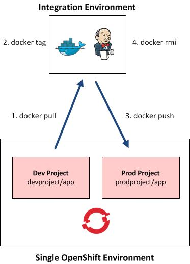
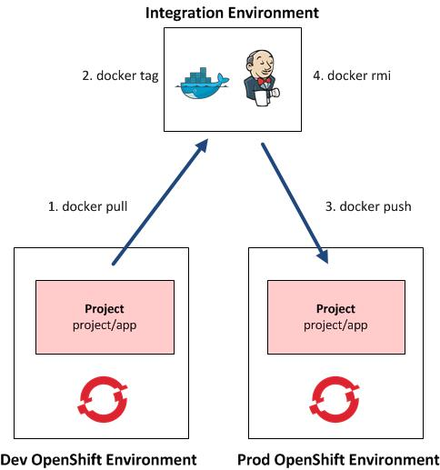

---
---
= OpenShift Enterprise 3 Image Promotion Strategies
Andrew Block <ablock@redhat.com>
v1.0, 2015-10-05
:scripts_repo: https://github.com/rhtconsulting/rhc-ose
:toc: macro
:toc-title:

include::../../_includes/variables.adoc[]
toc::[]

This document provides strategies for promoting an application between various OpenShift environments. The level of segregation of how environments are divided are at the discretion of the user. It is out of the scope of this particular document on how the application is built and packed into the initial image

== High Level Components

Each strategy defined within this document will have several consistent themes:

* 1:x OpenShift Environments with exposed Docker integrated registries
* Integration environment
** It is _recommended_ that the Jenkins CI server be used to facilitate the promotion process, however standalone scripts may be used instead if desired
Docker client to manipulate images

NOTE: The user executing the scripts must be a member of the docker group in order to access the Docker socket. Additional information on this topic can be found https://docs.docker.com/engine/installation/linux/fedora/[here]

== Prerequisites

The majority of the work involves an integration environment and then ability to access and communicate with both OpenShift Environments. To accomplish this, the integrated docker registry must be externally exposed for invocations by external parties. The process of externally exposing the integrated docker registry and configuring clients is described in External Access of link:../operationalizing/expose_docker_registry{outfilesuffix}[Integrated Docker Registry].Ensure the necessary software and docker client configurations are completed before proceeding.

== Promoting an Application Between Two Projects in the Same OpenShift Environment

This strategy utilizes two projects a single environment of OpenShift and an integration s configured with Docker client to retrieve an image from an integrated docker registry, tag and push back the tagged image to the same registry.

=== Components

* OpenShift Environment configured with two projects representing a Development and Production environments
* Integration Environment to facilitate application promotion

=== OpenShift Configuration

The use of a single OpenShift environment simplifies the configuration of both as credentials and configurations for both OpenShift and Docker as only a single set needs to be configured for both clients and in the integration environment. Two projects will need to be created to represent both the development and production environments.

The integrated docker registry within OpenShift has the ability to notify OpenShift when images change. Projects can react to these changes by either triggering new build or deployment in the form of triggers. In this case, we are interested in triggering a new deployment when an image is pushed to the production environment. Ensure the deploymentConfg for the project representing the production environment (and also the development environment if a a new deployment is desired when the image changes) has an ImageChange trigger defined.

=== Promotion Process:

The process of promoting an application involves the following steps:

. Process initiated on the intermediate environment
. Docker Image from the project representing the development environment is pulled from the OpenShift integrated registry onto the Integration Environment
. Docker tag is created representing the OpenShift registry and name of the project and application
. Docker tag is pushed to the OpenShift environment
. Docker image and tags are removed from the Integration environment

The following is a set of Docker commands that represent the types of actions being executed

[source]
----
# Pull from Origin Environment
docker pull <openshift_docker_registry>/<ose_origin_project>/<ose_app>

# Tag image for Promoted Environment
docker tag <origin_docker_registry>/<ose_origin_project>/<ose_app> <openshift_docker_registry>/<ose_promoted_project>/<ose_app>

# Push to Promoted Environment
docker push <openshift_docker_registry>/<ose_promoted_project>/<ose_app>

# Remove Images locally
docker rmi <openshift_docker_registry>/<ose_origin_project>/<ose_app>
docker rmi <openshift_docker_registry>/<ose_promoted_project>/<ose_app>
----

== Promoting an Application Between Two Separate OpenShift Applications

This strategy employs the use of multiple separate OpenShift environments and in integration environment configured with a docker client to retrieve an image from an integrated docker registry in one environment and push to another integrated registry in another environment.

=== Components

* OpenShift Environment representing a Development Environment
* OpenShift Environment representing a Production Environment
* Integration Environment to facilitate application promotion

=== OpenShift Configuration

While not required, the separation of OpenShift environments allow for identical project and application names to be specified. This will simplify the promotion process as variables can be reused between environments.

The integrated docker registry within OpenShift has the ability to notify OpenShift when images change. Projects can react to these changes by either triggering new build or deployment in the form of triggers. In this case, we are interested in triggering a new deployment when an image is pushed to the production environment. Ensure the deploymentConfg for the application in the production environment (and also the development environment if a a new deployment is desired when the image changes) has an ImageChange trigger defined.

=== Promotion Process

The process of promoting an application involves the following steps:

. Process initiated on the intermediate environment
. Docker Image is pulled from the OpenShift Development
Environment and onto the Integration Environment
. Docker tag is created representing the registry and name of the image for the OpenShift Production Environment
. Docker image is pushed to the OpenShift Production Environment
. Docker image and tags are removed from the Integration Environment

The following is a set of Docker commands that represent the types of actions being executed:

[source]
----
# Pull from Origin Environment
docker pull <origin_docker_registry>/<ose_project>/<ose_app>

# Tag image for Promoted Environment
docker tag <origin_docker_registry>/<ose_project>/<ose_app> <promoted_docker_registry>/<ose_project>/<ose_app>

# Push to Promoted Environment
docker push <promoted_docker_registry>/<ose_project>/<ose_app>

# Remove Images locally
docker rmi <origin_docker_registry>/<ose_project>/<ose_app>
docker rmi <promoted_docker_registry>/<ose_project>/<ose_app>
----
