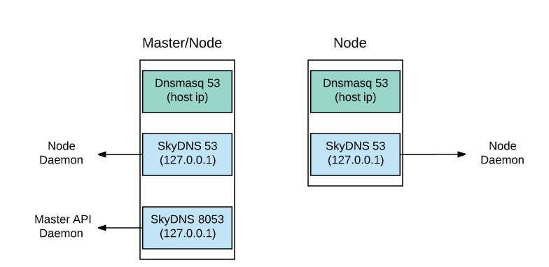
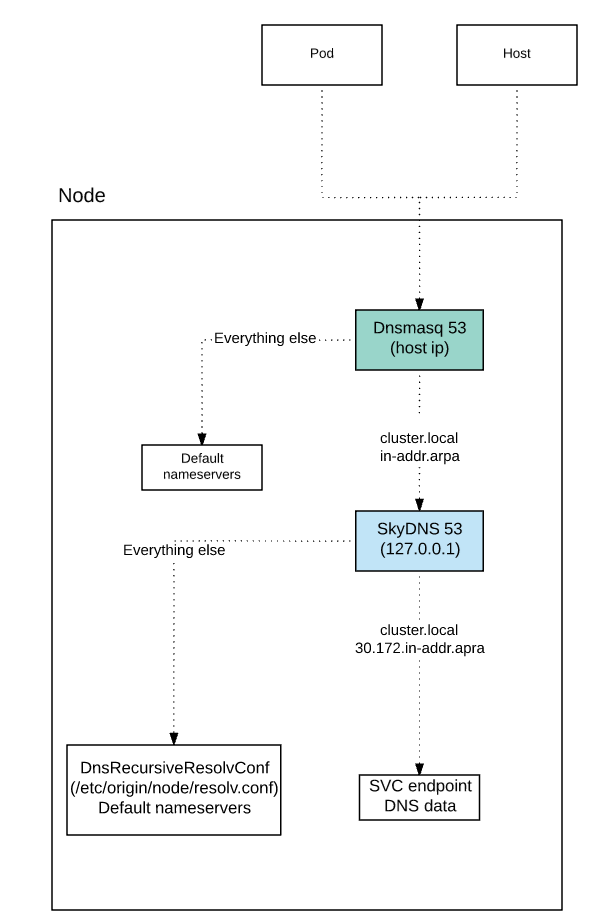
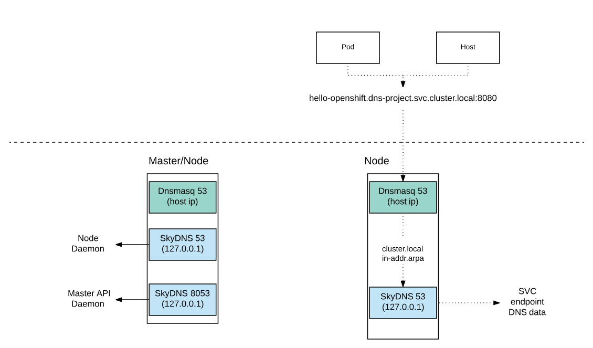

---
---
= OpenShift Container Platform DNS Deep Dive

Jooho Lee <jlee@redhat.com>
:toc: macro
:toc-title:

toc::[]

== DNS in OpenShift?

Regarding OpenShift, we are usually talking about two DNS servers.

- Corporate DNS (outside OCP) for Master internal/external hostname and router wildcard name.
- OpenShift DNS for communication between internal services.

In this blog, I would like to talk about the latter DNS, which is based on skyDNS. 
For demonstration purpose, a simple application “hello openshift” will be used. This is the script to deploy it.

[]
----

# Create DNS Demo Project
$ oc new-project dns-project

# Deploy hello world pod
$ curl https://raw.githubusercontent.com/openshift/origin/release-3.6/examples/hello-openshift/hello-pod.json|oc create -f -

# Check there is no svc
$ oc get svc
No resources found.

# Access the pod with Pod IP (Container IP - 10.x.x.x)
$ oc get pod -o wide
NAME             READY     STATUS    RESTARTS   AGE              IP                NODE
hello-openshift   1/1         Running             0            5s        10.130.2.13         XXXX

$ curl 10.130.2.13:8080
Hello OpenShift!

# Tip - use this command to use the Pod IP from your environment
$ curl $(oc get pod hello-openshift --template '{{ .status.podIP}}):8080
Hello OpenShift!

# Expose Service from Pod
$ oc expose pod hello-openshift 
service "hello-openshift" exposed

$  oc get svc
NAME              CLUSTER-IP     EXTERNAL-IP   PORT(S)    AGE
hello-openshift   172.30.12.46   <none>        8080/TCP   5s

----

== Internal DNS: Why do we need it? 

In order to answer this question, I am going to use a simple example. When it comes to communication between applications in the VM world (e.g. VMware, RHV), each application uses the IP address of the guest, which typically does not change. However, in the Docker world, the Docker container gets a new IP address whenever it spins up.

Kubernetes; which orchestrates Docker, needs a static IP for the container. The Kubernetes Service Object; which provides a Service IP, was created to do this, among other things. The Service Object has a hostname and an IP address. The hostname will not change, but the IP address will change if the Service Object is recreated.  With this Service hostname, stable internal communication between pods (services) becomes possible.

Because the Service IP can change, we don’t want to specify a static IP address in the application or DeploymentConfig Environment. What if the Service object is recreated without the application team being notified? A new Service IP will be assigned to the service and the applications that use the Service IP will fail.

For these reasons, we normally use the Service hostname to avoid the use of a hardcoded IP in the application. The internal DNS in OpenShift provides this functionality. It uses dynamic DNS, so whenever the Service Object is recreated, the DNS will be updated with new records. With this feature, each Service Object hostname (that has a specific format - refer to OpenShift Container Platform DNS) has a unique and dynamic Service IP address. As a result, we recommend using the hostname to communicate between internal services.

*Check Pod IP and Service IP/Hostname:*

```
# Check Service IP
$ oc get svc
NAME        CLUSTER-IP       EXTERNAL-IP   PORT(S)   AGE
hello-openshift   172.30.12.46     <none>        8080/TCP   7s

$  dig hello-openshift.dns-project.svc.cluster.local

;; QUESTION SECTION:
;hello-openshift.dns-project.svc.cluster.local. IN A

;; ANSWER SECTION:
hello-openshift.dns-project.svc.cluster.local. 30 IN A 172.30.12.46

;; Query time: 1 msec
;; SERVER: 10.10.181.97#53(10.10.181.97)
;; WHEN: Mon Oct 30 15:56:58 EDT 2017
;; MSG SIZE  rcvd: 79

# Access the pod with Service IP.
# hello openshift application can be accessible using service ip from another application like following.   
$ curl 172.30.12.46:8080
Hello OpenShift!

# Access the pod with Service Hostname
# Also, you can get the same result using service hostname.
$ curl hello-openshift.dns-project.svc.cluster.local:8080
Hello OpenShift!
```

== Internal DNS: Where is it? 

Internally, the DNS uses SkyDNS, which uses etcd.  Since OpenShift 3 was released, the internal DNS has changed twice, in OpenShift 3.2 and 3.6.  Prior to 3.6, SkyDNS always ran on the master nodes (‘masters’), so pods in infrastructure/application nodes (‘nodes’) had to access one of the masters in order to resolve Service hostnames. 

*_Main Changes in 3.2_* 

- Dnsmasq is installed by default on masters and nodes
- NetworkManager is required on masters and nodes
- SkyDNS listens on port 8053 on the masters
- All nodes connect to the masters on TCP/8053
- Dnsmasq routes queries for cluster.local to Kubernetes Service IP (172.30.0.1:53)

image::images/openshift3.5_dns.png[title=Figure 1. DNS Structure for **OpenShift 3.2 - 3.5**]
_Note: OpenShift 3.2 - 3.5 has the DNS structure below_


*_Main Changes in Openshift 3.6_*

- Dnsmasq was optional but now is mandatory.
- SkyDNS runs on masters and nodes
.. On masters, SkyDNS listens on port 8053 to avoid port conflict
.. On nodes, SkyDNS listens on port 53
- Dnsmasq routes queries for cluster.local and in-addr.arpa to 127.0.0.1:53




== Deep Dive

=== Daemons & Port Mapping:

As the above diagram (Figure 3) shows, there are 3 DNS daemons on masters. Let’s check which process uses each DNS port. The following output show detailed information.

[]
----
# Show daemons that listen on *53
# netstat -tunlp|grep 53
tcp        0      0 0.0.0.0:8053            0.0.0.0:*               LISTEN      47645/openshift     
tcp        0      0 127.0.0.1:53            0.0.0.0:*               LISTEN      47678/openshift     
tcp        0      0 10.10.181.97:53       0.0.0.0:*              LISTEN      47644/dnsmasq       
….

# Show process names that use *53 ports
# ps -ef|grep openshift
root      47645      1  2 13:15 ?        00:02:08 /usr/bin/openshift start master api ...
root      47678      1  4 13:15 ?        00:03:17 /usr/bin/openshift start node ..
----

=== Dispatch Nameserver by Dnsmasq
Dnsmasq is still responsible for dispatching queries inside pods to the right nameserver. Until OpenShift 3.5, if it queried `cluster.local`, Dnsmasq was sending it to SkyDNS on master nodes, but now it goes to 127.0.01:53 because skyDNS is on all nodes in OpenShift 3.6. Plus, if it queries `in-addr,arpa`, it also returns the Service hostname. From dnsmasq configuration files, we can see that it forwards the queries that contain `cluster.local` and ` in-addr,arpa`  to 127.0.0.1:53.

----
# # Show all configuration about dnsmasq
# grep . /etc/dnsmasq.d/*
/etc/dnsmasq.d/node-dnsmasq.conf:server=/in-addr.arpa/127.0.0.1
/etc/dnsmasq.d/node-dnsmasq.conf:server=/cluster.local/127.0.0.1
/etc/dnsmasq.d/origin-dns.conf:no-resolv
/etc/dnsmasq.d/origin-dns.conf:domain-needed
/etc/dnsmasq.d/origin-dns.conf:no-negcache
/etc/dnsmasq.d/origin-dns.conf:max-cache-ttl=1
/etc/dnsmasq.d/origin-dns.conf:enable-dbus
/etc/dnsmasq.d/origin-dns.conf:bind-interfaces
/etc/dnsmasq.d/origin-dns.conf:listen-address=10.10.181.97 # default route interface IP
/etc/dnsmasq.d/origin-upstream-dns.conf:server=10.10.182.21 # original name server IP


# # Check if *.cluster.local can be resolved
# dig hello-openshift.dns-project.svc.cluster.local

;; QUESTION SECTION:
;hello-openshift.dns-project.svc.cluster.local. IN A

;; ANSWER SECTION:
hello-openshift.dns-project.svc.cluster.local. 30 IN A 172.30.12.46

;; Query time: 1 msec
;; SERVER: 10.10.181.97#53(10.10.181.97)

# # Check if *.in-addr.arpa  can be resolved
#  dig -x 172.30.12.46

;; QUESTION SECTION:
;46.12.30.172.in-addr.arpa.	IN	PTR

;; ANSWER SECTION:
46.12.30.172.in-addr.arpa. 30	IN	PTR	hello-openshift.dns-project.svc.cluster.local.

;; Query time: 1 msec
;; SERVER: 10.10.181.97#53(10.10.181.97)
----

== NetworkManager with Dnsmasq

NetworkManager dispatcher 99-origin-dns.sh replicates the functionality of NetworkManager's dns=dnsmasq.  With this script, it makes the default route IP to Dnsmasq listen IP.  Container uses this IP as a default nameserver.

99-origin-dns.sh logs to journald on the unit NetworkManager-dispatcher


==== This dispatch script does:
- creates dnsmasq conf files :
.. node-dnsmasq.conf 
.. origin-dns.conf  
.. origin-upstream-dns.conf
- starts Dnsmasq daemon by default when NetworkManager start.
- sets host default route IP to Dnsmasq listen IP.
- updates /etc/resolv.conf using host default route IP.
- creates /etc/origin/node/resolv.conf


== DNS Query Flow Condition in OpenShift 3.6


dns_flow_ocp_36.png

== DNS Query Flow in OpenShift 3.6

_Note: No need to reach the Master from the Node to get SVC DNS data_


== Debugging DNS Flow with tcpdump

_Test env:_

- Master Node
.. IP: 10.10.181.97
.. Hostname: dhcp181-97.gsslab.rdu2.redhat.com
- App Node
.. IP: 10.10.181.196
.. Hostname: dhcp181-196.gsslab.rdu2.redhat.com
- SkyDNS
.. IP: 127.0.0.1
- Upstream Nameserver
.. IP: 10.10.182.21


Executing tcpdump command fo
```
# On App Node 
$  tcpdump  -xx -vvvv  -s 0 -l -n -i any port 53 -w test.pcap

```

==== Scenario 1. Resolve Master hostname from one of app nodes 
Node query will access Dnsmasq and forward it to upstream DNS.

```
# Command
$ dig dhcp181-97.gsslab.rdu2.redhat.com

# Result
1 10.10.181.196   10.10.181.196  DNS  … dhcp181-97.gsslab.rdu2.redhat.com OPT
2 10.10.181.196   10.10.182.21   DNS ... dhcp181-97.gsslab.rdu2.redhat.com OPT
3 10.10.182.21    10.10.181.196   DNS ...  dhcp181-97.gsslab.rdu2.redhat.com A 10.10.181.97 NS ns01.xxx.redhat.com NS ns02.xxx.redhat.com A x.x.x.x A x.x.x.x OPT
4 10.10.181.196   10.10.181.196   DNS dhcp181-97.gsslab.rdu2.redhat.com A 10.10.181.97 NS ns01.xxx.redhat.com NS ns02.xxx.redhat.com A x.x.x.x A x.x.x.x OPT
```

==== Scenario 2. Resolve Service hostname from one of app nodes
Node query will access Dnsmasq and forward it to SkyDNS.
```
# Command 
$ dig  hello-openshift.dns-project.svc.cluster.local

#Result 

1 10.10.181.196 10.10.181.196DNS hello-openshift.dns-project.svc.cluster.local OPT
2 127.0.0.1            127.0.0.1     DNS hello-openshift.dns-project.svc.cluster.local OPT
3 127.0.0.1            127.0.0.1     DNS hello-openshift.dns-project.svc.cluster.local A 172.30.12.46
4 10.10.181.196 10.10.181.196DNS hello-openshift.dns-project.svc.cluster.local A 172.30.12.46
```

==== Scenario 3. Resolve Service hostname inside docker container from one of app nodes
Pod query will access Dnsmasq and forward it to SkyDNS.
```
# Command inside container
sh-4.2# ip a
    ….
    inet 10.131.2.17/23 scope global eth0
   ...

sh-4.2# dig  hello-openshift.dns-project.svc.cluster.local


# Result
1 10.131.2.17   10.10.181.196   DNS Standard query A hello-openshift.dns-project.svc.cluster.local OPT
2 10.131.2.17   10.10.181.196   DNS Standard query A hello-openshift.dns-project.svc.cluster.local OPT
3 127.0.0.1     127.0.0.1       DNS Standard query A hello-openshift.dns-project.svc.cluster.local OPT
4 127.0.0.1     127.0.0.1       DNS Standard query response A hello-openshift.dns-project.svc.cluster.local A 172.30.12.46
5 10.10.181.196 10.131.2.17     DNS Standard query response A hello-openshift.dns-project.svc.cluster.local A 172.30.12.46
6 10.10.181.196 10.131.2.17     DNS Standard query response A hello-openshift.dns-project.svc.cluster.local A 172.30.12.46
```

== Reference:
- serviceresolver.go
- network_config.go
- https://wiki.archlinux.org/index.php/dnsmasq#NetworkManager

