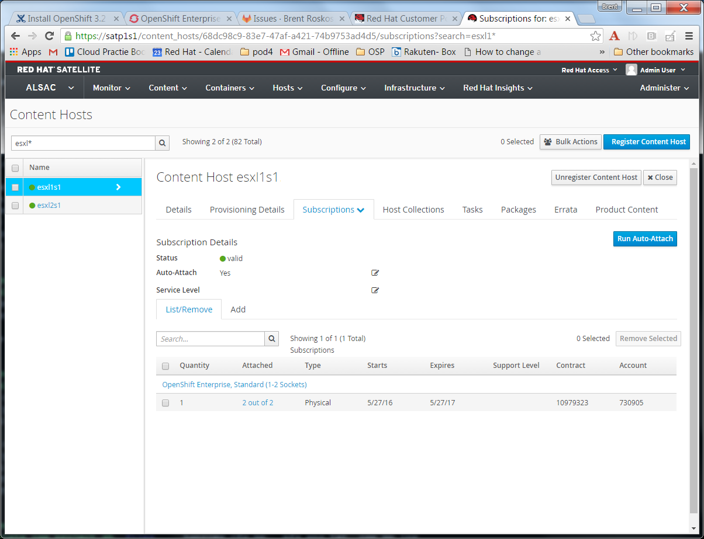
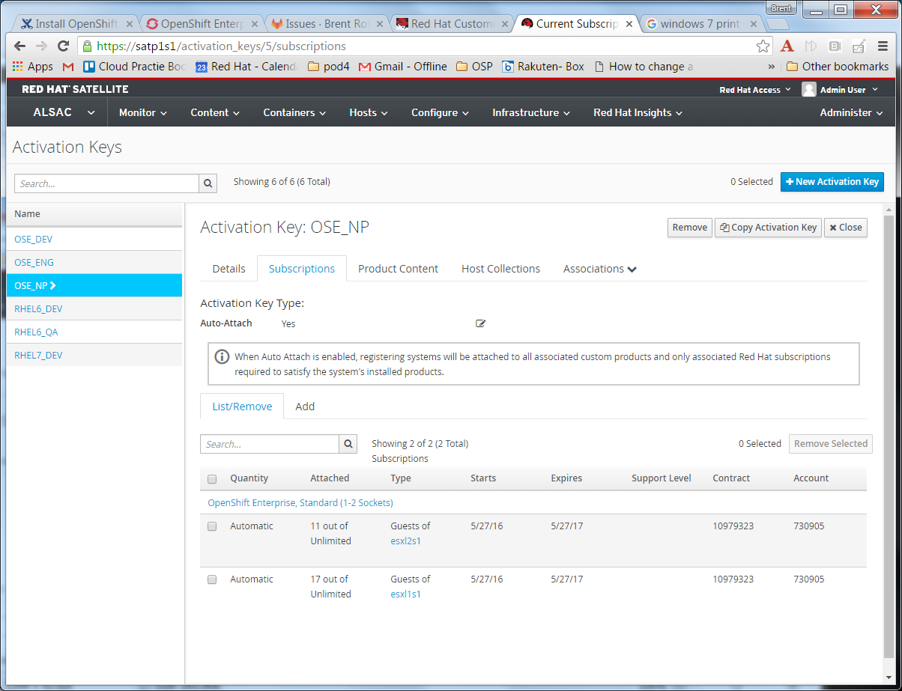

---
== Satellite info for managing unlimited guest subscriptions

In order to leverage 'unlimited guest' subscriptions we need a mapping service to provide HV <--> VM mappings. +
Virt-who is the package that does this for us.

=== KVM
In a KVM environment virt-who is installed on all Hypervisors and these hypervisors are registered to satellite normally.
No additional configuration is necessary, just ensure that the hypervisors are attached to the correct pool so that they consume
one of the per-cpu entitlements.

==== Install virt-who
----
# yum install -y virt-who
----

Jump to <<Configure Activation Keys on Satellite>>

=== VMWare
For VMWare, we need virt-who to run as a service on a RHEL server or VM.  In this capacity virt-who acts as an 'agent'
and talks to vCenter and reports mappings back into Satellite.
Select a server or VM to host this service and install the virt-who package.  Have a VMWare administrator create a read-only
service account that allows access into vCenter for the virt-who service.

==== Install virt-who
----
# yum install -y virt-who
----

==== Configure /etc/sysconfig/virt-who with the following configuration (VMWare only)
----

# vim /etc/sysconfig/virt-who

VIRTWHO_INTERVAL=3600
VIRTWHO_SATELLITE6=1
VIRTWHO_BACKGROUND=1
VIRTWHO_DEBUG=0
----

==== Configure /etc/virt-who.d/conf (VMWare only)
----
# vim /etc/virt-who.d/conf

[vcenter]
type=esx
owner={Satellite Org name}
env=Library
server={Satellite server fqdn}
username={nt_domain\service_account_username}
password={password}
hypervisor_id={fqdn of agent server running virt-who}
----

==== Enable and Start virt-who services (VMWare only)
----
# systemctl enable virt-who
# systemctl start virt-who
----

==== Apply subscriptions to selected hypervisors in Satellite
From Satellite, use content_hosts to locate the hypervisors which should have the unlimited guests subscriptions,
then use the Subscriptions tab to apply them.

==== Configure Activation Keys on Satellite
Now that the hypervisors have the subscriptions attached to them, there will be a new subscription available
"guests of xxxx" for each licensed hypervisor.  Navigate to your activation keys and apply these new "guests of"
subscription to each activation key that needs them.  Activation keys can have more than one subscription and subscriptions
can be attached to multiple activation keys.

