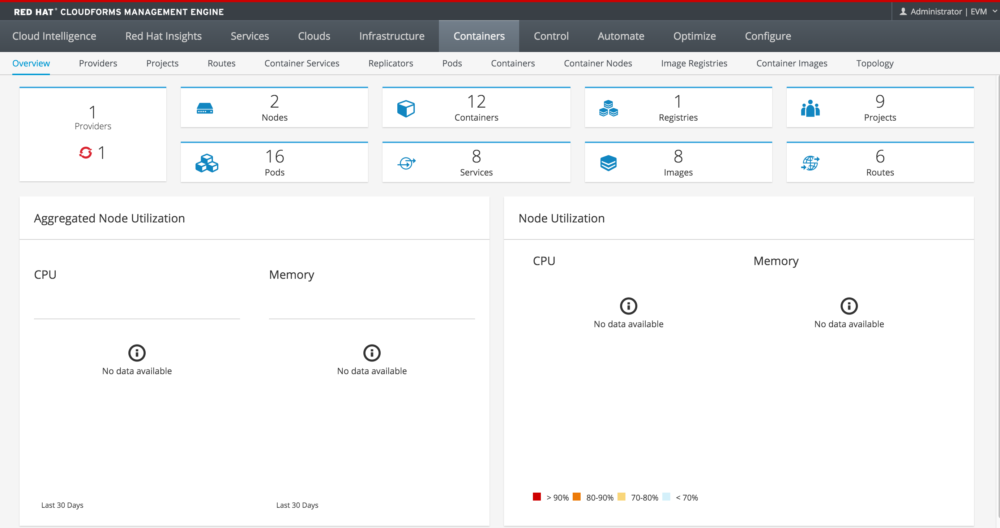
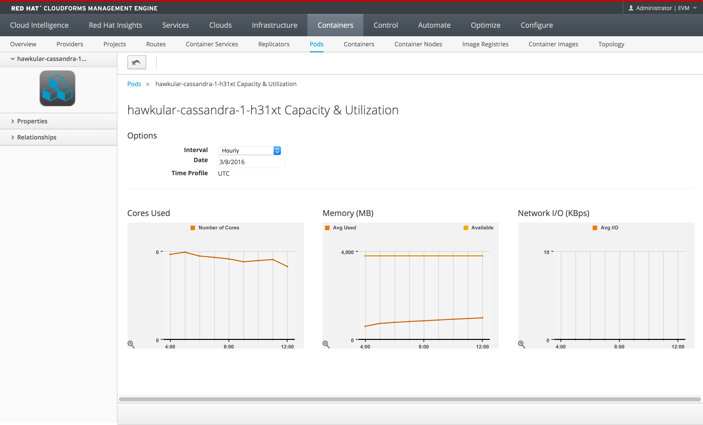
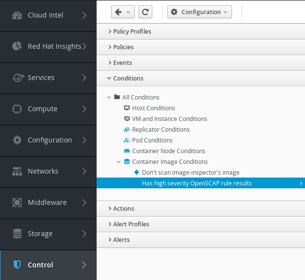
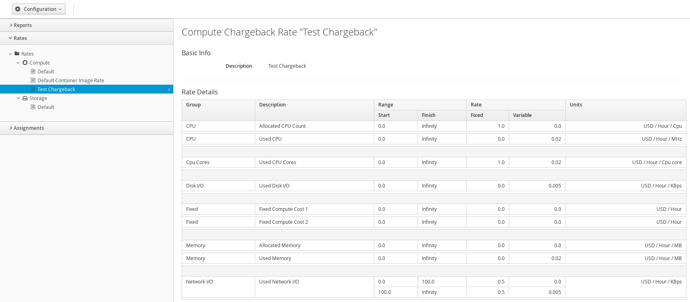
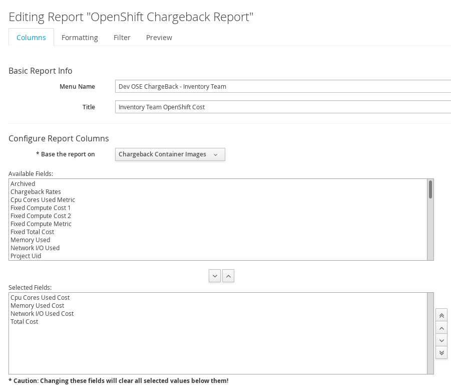
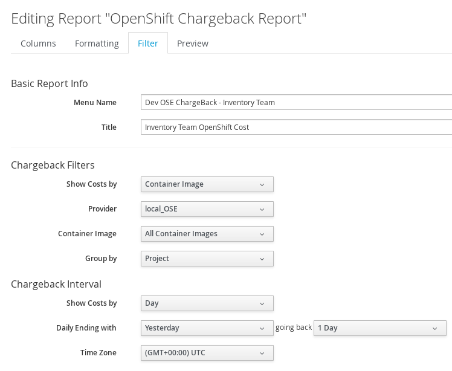
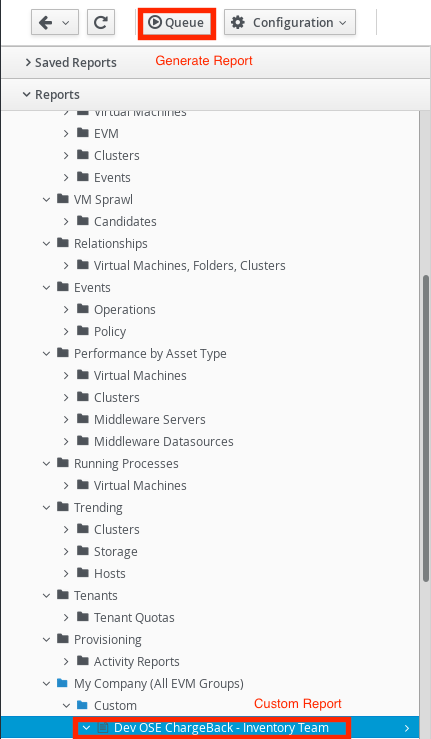
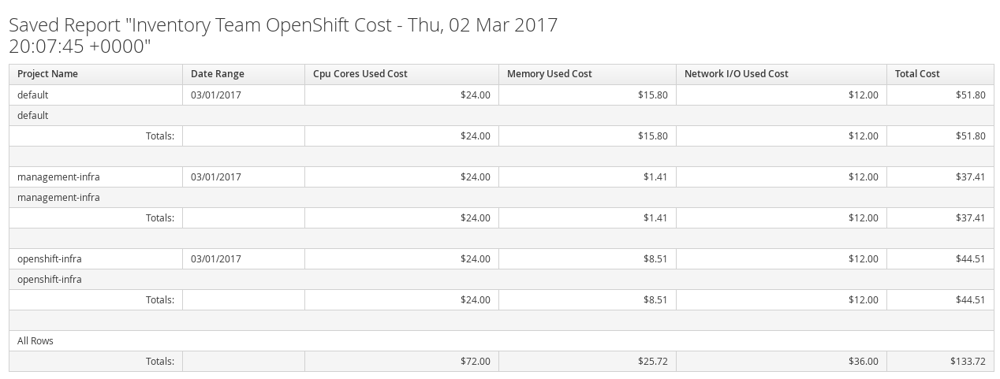

---
---
= CloudForms Integration with OpenShift Enterprise v3
Andrew Block <ablock@redhat.com>
v1.0, 2016-03-30
:scripts_repo: https://github.com/rhtconsulting/rhc-ose
:toc: macro
:toc-title:

Beginning with version 3.1, OpenShift officially supported integration with CloudForms 4 to provide a single pane of glass over the OpenShift environment.  

toc::[]

== Overview

Red Hat CloudForms provides a singular monitoring and reporting tool over an entire OpenShift cluster. For CloudForms to retrieve telemetry information from OpenShift, communication is performed both with the OpenShift API and by tapping into the cluster metrics components provided by the link:https://github.com/kubernetes/heapster[Heapster] and link:http://www.hawkular.org/[Hawkular] frameworks. As a prerequisite, the steps described in the link:https://docs.openshift.com/enterprise/latest/install_config/cluster_metrics.html[Enabling Cluster Metrics] documentation must be completed before integration can begin.This document will describe the process for preparing OpenShift for CloudForms and the steps necessary to integrate the two platforms.

== Preparing OpenShift for CloudForms integration

This section describes the steps necessary to prepare OpenShift for CloudForms integration.

=== OpenShift Container Platform Managment Infrastrcture Service Account

Core environment statistics, such as nodes, images and pods, from OpenShift are accessed by CloudForms by communicating with the OpenShift API. This communication is negotiated with the help of an OpenShift service account explicitly configured for use by CloudForms. In OpenShift version 3.1, a new built-in project called _management-infra_ is available to allow integration with third party tools, such as CloudForms. This project provides a management service account named _management-admin_ which can be used to facilitate communication with OpenShift. 

The steps described below are also found in the link:https://access.redhat.com/documentation/en/red-hat-cloudforms/version-4.0/managing-providers/#containers_providers[Container Providers] section of the OpenShift documentation.

NOTE: Newer versions of the https://github.com/openshift/openshift-ansible[openshift-ansible] playbooks configure the _management-infra_ project automatically if the `openshift_hosted_metrics_deploy` flag is set to `true` in your OpenShift Ansible inventory/hosts file. Otherwise, please consult the aforementioned documentation to setup the project. 

Execute the following commands in the OpenShift environment to retrieve the service account token which will be used to communicate with OpenShift from CloudForms.

==== OpenShift Container Platform 3.2 / 3.3
[source]
----
# oc sa get-token -n management-infra management-admin
eyJhbGciOiJSUzI1NiI...
----

==== OpenShift Container Platform 3.1
[source]
----
# oc get -n management-infra sa/management-admin --template='{{range .secrets}}{{printf "%s\n" .name}}{{end}}'

management-admin-token-59thq <1>
management-admin-token-8c2mk
management-admin-dockercfg-de6dh

# oc get -n management-infra secrets management-admin-token-59thq --template='{{.data.token}}' | base64 -d 

eyJhbGciOiJSUzI1NiIsInR5cCI6IkpXVCJ9.eyJpc3MiOiJrdWJlcm5ldGVzL3NlcnZpY2VhY2NvdW50Iiwia3ViZXJuZXRlcy5pby9zZXJ2aWNlYWNjb3VudC9uYW1lc3BhY2UiOiJtYW5hZ2VtZW50LWluZnJhIiwia3ViZXJuZXRlcy5pby9zZXJ2aWNlYWNjb3VudC9zZWNyZXQubmFtZSI6Im1hbmFnZW1lbnQtYWRtaW4tdG9rZW4tNTl0aHEiLCJrdWJlcm5ldGVzLmlvL3NlcnZpY2VhY2NvdW50L3NlcnZpY2UtYWNjb3VudC5uYW1lIjoibWFuYWdlbWVudC1hZG1pbiIsImt1YmVybmV0ZXMuaW8vc2VydmljZWFjY291bnQvc2VydmljZS1hY2NvdW50LnVpZCI6IjZjNThlZDMyLWUyOTgtMTFlNS1hZmY0LWZhMTYzZTlkOTQ0NyIsInN1YiI6InN5c3RlbTpzZXJ2aWNlYWNjb3VudDptYW5hZ2VtZW50LWluZnJhOm1hbmFnZW1lbnQtYWRtaW4ifQ.F59Z38mcEktTRWjgz8yjQgbudgtEg5wBE-t7OpIAoO42ozpTOohSQSaTo5yO_9jIQQo8eb4MiJEWtEX5EbkqJ1anMRrp67qxBYVIfdNC2xmQ1wVHQYvvYe8JsLjrumKDDfOhk4CY1vJbAXeRkO3BBuUaJFODWjxBQWzyC55yB4YZpmXIY8WiVky9BbnwOSLzq0QCBggThrZpUWu60UrxpMliW_1hwJPIJ0mTXIwXRNWp7GjhAIECr8og2EXhAKwJ5YpM0kzilAt27zXYOH_5m5Oi_jgKt98LYFzN4sZlqA6ei_ePzLKxb5f48dx2UGHFzKD8XRSk_nVRUqGSqHuWqA <2>
----
<1> This is the name of the secret containing the token
<2> The token that will be used to communicate between CloudForms and OpenShift

=== OpenShift Container Platform API Access

==== CloudForms Managment Engine 4.1 and above

In CloudForms Managment Engine 4.1 and above CloudForms can use the OpenShift public hostname to access OpenShift. So nothing needs to be done here.

==== CloudForms Managment Engine 4.0

IMPORTANT: In CloudForms 4.0, due to a limitation within the product, only a single hostname can be used to communicate with OpenShift.  As previously mentioned, CloudForms communicates with OpenShift via the API to retrieve basic environment information, but it also needs to communicate over port 5000 to retrieve cluster metrics from Hawkular. This requires a deployment of an additional router on the OpenShift master to access the SDN to communicate with Hawkular. An alternate solution is available where a Virtual IP Address (VIP) is used to provide a single destination for CloudForms, but to provide the appropriate logic necessary to route the traffic accordingly depending on the request. Please see the link:/playbooks/operationalizing/cloudforms_networking{outfilesuffix}[Network Integration for OpenShift v3 and Red Hat CloudForms] document for more information. *The Metrics Collections section can be skipped if the implementation covered in the aforementioned documentation is adhered to, or if CloudForms 4.1 or later is used.*

To support the deployment of a router on the master, the master must be configured as schedulable. Execute the following command to make the master schedulable: 

[source]
----
oadm manage-node <master-hostname> --schedulable=true
---- 

Deploy the router by executing the following command and be sure to specify the _kubernetes.io/hostname_ selector to match the name of the master instance. This ensures the router will deployed on the master instead of any other schedulable instance. If multiple masters are used, apply a unique label to each master and use the key/value pair instead

[source]
----
    oadm router management-metrics \
    -n default \
    --credentials=/etc/origin/master/openshift-router.kubeconfig \
    --service-account=router --ports='443:5000' \
    --selector='kubernetes.io/hostname=<host_name>' \
    --stats-port=1937 \
    --host-network=false
----

Finally, since CloudForms is configured with the hostname of the master for both API and metrics traffic, an application route must be configured with the hostname of the master in order for the integrated registry to route the request appropriately to Hawkular. 

Create a file called _metrics-route.yaml_ with the following text:

[source]
.metrics-route.yaml
----
apiVersion: v1
kind: Route
metadata:
  name: metrics-route
spec:
  host: master.ose.example.com 
  to:
    kind: Service
    name: hawkular-metrics
  tls:
    termination: passthrough
----

Add the route to the openshift-infra project
[source]
----
oc create -f metrics-route.yaml -n openshift-infra 
----

The required steps in OpenShift have been completed in order to support CloudForms integration.

== Configuring CloudForms

This section describes the steps necessary to install a Red Hat CloudForms instance and configure it to communicate with an OpenShift environment

=== CloudForms Environment Sizing

CloudForms can be deployed into all types of environments. A full https://access.redhat.com/documentation/en/red-hat-cloudforms/version-4.0/deployment-planning-guide/[CloudForms Deployment Planning Guide] is available to help prepare and implement a CloudForms solution.

=== CloudForms Installation

The CloudForms appliance is delivered as a virtual image template that can be installed on several platforms including OpenStack, Red Hat Enterprise Virtualization and in the VMWare vSphere environment. Consult the link:https://access.redhat.com/documentation/en/red-hat-cloudforms/[installation documentation] for platform specific directions outside of the materials provided here.

Once the machine is up and available, use ssh to login using the username/password combination of `root/smartvm`

Configure CloudForms and database connectivity according to the documentation and to your specific environment using the `appliance_console` command.

At a minimum, this requires the following `appliance_console` menu items:

* 2. Set static network configuration
* 5. Configure Timezone, Date and Time
* 8. Configure Database

Once the configurations have been applied, select option 15 to apply the changes and to restart the VM

For installations that contain more than one appliance, repeat the above steps making sure to join an existing database cluster when completing step 8. 

Once the machine reboots, the web console should be accessible at the host public ip.

\https://<public_host>

The default username/password combination is _admin/smartvm_

After logging into the console, configure basic server settings by select the *configure* tab and then the *configuration* sub tab. 

Set the *Company Name* to customize the name of the organization. Next, specify the *Appliance Name* as the value that should be visible on the appliance that is logged into. 

Under the _Server Control_ section, apply the following roles based on the appliance type:

NOTE: If an all in one deployment of CloudForms is being utilized, all roles can be selected

.DB Server Role
[options="header,footer"]
|=======================
|Role
|Database Operations
|Database Synchronization
|User Interface
|Web Services
|=======================

.Worker Server Role
[options="header,footer"]
|=======================
|Role
|Automation Engine
|Capacity and Utilization (3 Roles)
|Event Monitor
|Provider Inventory
|Provider Operations
|Notifier
|Scheduler
|SmartProxy
|SmartState Analysis
|User Interface
|=======================

.UI Server Roles
[options="header,footer"]
|=======================
|Role
|Automation Engine
|Capacity and Utilization (3 Roles)
|Notifier
|Reporting
|RHT Mirror
|Scheduler
|User Interface
|=======================

=== Configure the OpenShift CloudForms Provider

==== CloudForms 4.0:

In the CloudForms web console, select the *Containers* tab and then select *Providers*.

Select the *Configuration* button and then *Add a New Containers Provider*.

Enter a name for the provider, select *OpenShift Enterprise* in the type, enter the address of the master and then the token retrieved earlier into the *Token* field. Click *Validate* to confirm connectivity. 

Click *Add* to add the container provider.

==== CloudForms 4.1:

In the CloudForms web console, hover over *Compute* in the menu on the left, then *Containers*, then select *Providers*.

Select the *Configuration* button and then *Add a New Containers Provider*.

Enter a name for the provider and select *OpenShift Enterprise* in the type (ignore the zone, this will populate on its own). 

Under *Endpoints*, in the *Default* tab, enter the hostname or address of the HAProxy server (or the master in a single master setup) into the *Hostname* field and enter the token retrieved earlier into the *Token* and *Confirm Token* fields. Click *Validate* to confirm connectivity.

Under *Endpoints*, select the *Hawkular* tab and enter the hawkular-metrics hostname into the *Hostname* field. 
    *Note* Adding the hawkular-metrics hostname in this field eliminates the need for any special routing to connect CloudForms to Hawkular Metrics.

Click *Add* to add the container provider.

=== Verify data collection

After a minute or two, click the *Overview* tab to view the data collected

The metrics from specific pods and containers is also also available by navigating to the *Pods* submenu, selecting the desired pod and hitting the *Utilization* button.

A full overview of steps necessary to integrate CloudForms with OpenShift including the enablement of cluster metrics can be found in the https://access.redhat.com/solutions/2137531[How to configure environments to see metrics of Openshift in Cloudforms] solutions article. *Note* Step 6, configuring a router on a master node, is not necessary when using CloudForms 4.1.

== SmartState Analysis

CloudForms provides the functionality to inspect the packages included as part of Docker images through its' SmartState Analysis process. The enables administrators a method to validate the packages that are running in containers across their enterprise.

=== Starting a SmartState Analysis

To initiate a SmartState Analysis of a container image, in the CloudForms user interface, select *Containers* and then *Container Images*. Select the image from the list. Click the *Configuration* button and then *Perform SmartState Analysis*

The analysis process is asynchronous, but the progress can be tracked by selecting the *Configure* tab at the top and then selecting *Tasks*

=== SmartState Process Break Down

The following steps occurs during a SmartState container image analysis:

1. CloudForms will communicate with OpenShift to start a pod in the _management-infra_ project to perform the analysis
2. Once the pod is instantiated, the Docker container image that is being inspected is pulled from the source docker registry.
3. An analysis of the image is performed by the pod
4. The results are made available via a WebDAV server in the pod
5. CloudForms will communicate via the OpenShift API via the pod proxy to the WebDAV server to retrieve the results of the inspection 

=== link:https://www.open-scap.org/[OpenSCAP] Default Condition
In general, the security policy is a crucial part of your overall compliance solution.  There are several security specifications and some party provide SCAP content. Red Hat also provide standard SCAP Security Guide that can be used with OpenSCAP according to platform type. This security guide contains many checking list such as Red Hat Errata security advisories. In addition to it, CloudForms Control allows you to add a condition statement with OpenSCAP.  By default, there is one condition for container image. It says `If OpenSCAP rule result has high severity, it fails to deploy any containers using the image.`

.The path of CloudForms OpenSCAP Default Condition
Controle => Conditions => Container Image Conditions

.Condition Expression
--
FIND Container Image.Openscap Rule Results : Result = "fail" CHECK ANY Severity = "High" 
--

== Chargeback for OpenShift Container Platform
Red Hat CloudForms provides Chargeback feature allows an administrator to calculate monetary projects/containers charges. The administrator creates Chargeback rate based on mainly Compute or Storage.  In order to gather data, it takes a couple of hours hence, it does not show any record during the time. Refer official document for link:https://access.redhat.com/documentation/en-us/red_hat_cloudforms/4.2/html-single/monitoring_alerts_and_reporting/#sect_chargeback[Chargeback]

=== Create Chargeback Rate
In the CloudForms user interface, select *Cloud Intel* => *Chargeback* =>  *Rates* => *Compute*. Click the *Configuration* button and then  *Add a new Chargeback Rate*.
Give a name to *Description* and choose *Currencies* then, click *Add*.

== Report
Red Hat CloudForms provides report tool. With this feature and Chargeback, an administrator can get monetary charges grouped by project, container and so on.

=== Create Custom Report
In the CloudForms user interface:

1) select *Cloud Intel* => *Report* =>  *Reports*.  

2) Click the *Configuration* button and then  *Add a new Report*.

[cols="1,1,2", options=header"]
.Columns Tab
|===
|Label
|Value
|Memo

|Menu Name
|Dev OSE Chargeback - Inventory Team 
|This name will be used for CF report menu

|Title
|Inventory Team OpenShift Cost
|This name will be used for *Saved Reports menu*

|*Base the report on
|Chargeback Container Images
|

|Available Fields
|
- Cpu Cores Used Cost
- Memory Used Cost
- Newtork I/O Used Cost
- Total Cost
|===

3) Click *Filter Tab* 

[cols="1,1,2", options=header"]
.Filter Tab
|===
|Label
|Value
|Memo

|Show Costs by
|Container Image
|

|Provider
|Dev OpenShift
|This is provider name. **Should be changed according to your environment**

|Container Image
|All Container Images
|

|Group by 
|Project
|

|===

3) Click *Save*.

=== Generating Report
1) Go to *My Company(All EVM Groups) => Custom*
Now, you can see a new custom report `Dev OSE Chargeback Inventory Team`. 

2) Click the custom report.

3) On the report, click *Queue* button.

4) Click the complete saved report.

