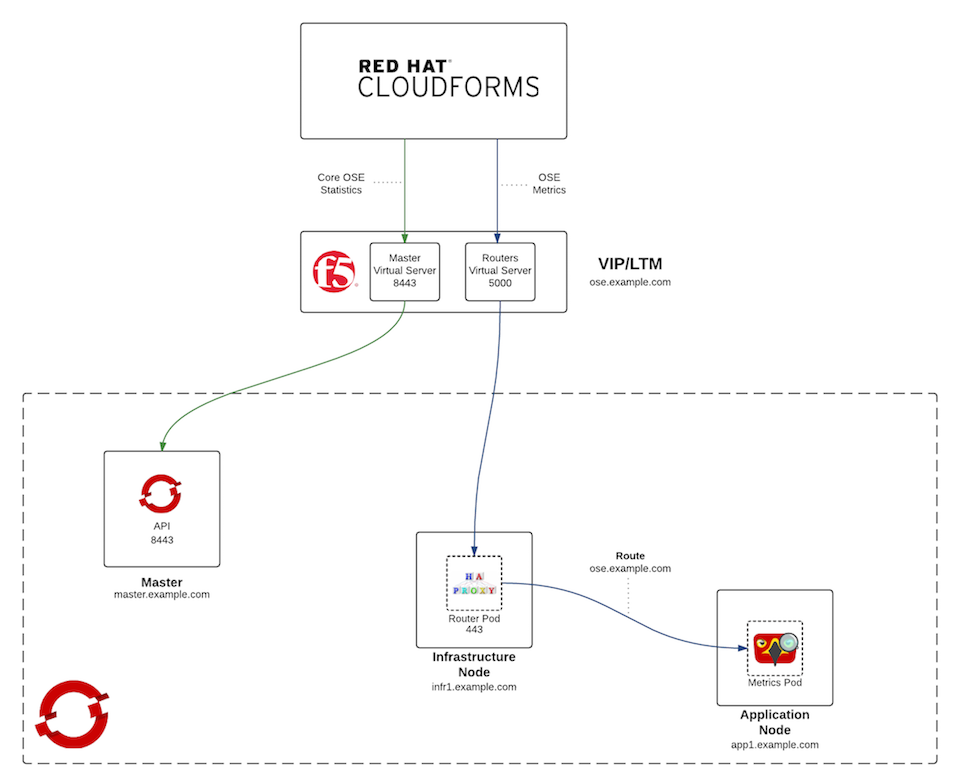

---
---
= Network Integration for OpenShift v3 and Red Hat CloudForms
Andrew Block <ablock@redhat.com>
v1.0, 2016-03-24
:scripts_repo: https://github.com/rhtconsulting/rhc-ose
:toc: macro
:toc-title:

Steps to overcome network limitations in integration OpenShift v3 with CloudForms

toc::[]

== Abstract

CloudForms provides a single pane of glass over an OpenShift environment. To facilitate the ingestion by CloudForms, OpenShift exposes two primary types of metrics:

* Overall environment statistics (Nodes, pods, routes, etc)
* Application metrics

These resources are provided by two separate sets of services in the OpenShift environment: the API and cluster metrics. The API is a service that runs on the OpenShift master instances to provide access to the topology of the environment, while cluster metrics are provided as running application containers from the link:http://www.hawkular.org/[Hawkular] project to measure the performance of the environment. In CloudForms today, the Container provider communicates with a single fixed hostname or IP address. This becomes a challenge when integrating CloudForms with OpenShift as both types of services must be accessed from a single host. Most architectures of OpenShift split out master and application (serviced by router pods running on nodes) communication in order to provide a separation of concerns and to optimize network traffic. To overcome this limitation, it is recommended in the link:https://access.redhat.com/documentation/en/red-hat-cloudforms/version-4.0/managing-providers/[CloudForms Provider Management documentation] that a secondary application router be deployed on each master instance with the sole purpose of serving service traffic for CloudForms. 

The deployment of a router on master instances is typically not recommended due to the following reasons:

* Separation of concerns between master and application traffic
* When master instances are also configured as nodes, they are marked as unschedulable by default. This ensures no applications will be deployed on these instances, which could potentially affect available resources and segregate the performance of the master 
* Additional network firewall ports to open on master instances

The purpose of this document is to provide an alternative solution for integrating CloudForms and OpenShift by leveraging a Local Traffic Manager (LTM), such as F5 Big-IP(™), to provide the mechanisms of routing traffic based on service type to the underlying components.

== Solution Overview

To overcome the requirement of deploying a router on OpenShift master instances, the provisioning and configuration of a VIP using an LTM alongside configurations in the OpenShift environment will be required. 

NOTE: It is recommended that the link:/playbooks/installation/load_balancing.html[External Load Balancers Guide] which covers the load balancing strategies in OpenShift be reviewed prior to implementing this solution.

The following sections detail the necessary steps.

=== Local Traffic Manager Configuration

Since CloudForms requires a single point of entry for container providers, a Local Traffic Manager can be utilized to create a VIP backed by a set of virtual servers and corresponding load balancing pools representing components within OpenShift to control the flow of traffic. A VIP contains a single DNS that contains two virtual servers in the LTM. A virtual server is represented by an IP address and a service (port in this case) that will receive traffic for further processing. These include:

* ose.example.com listening on port 8443 to process traffic destined for the OpenShift API
* ose.example.com listening on port 5000 to process traffic destined for the OpenShift Metrics components (Hawkular)

Also configured in the LTM are two sets of load balancing pools. Load balancing pools are logical sets of devices that are grouped together to receive and process traffic. These include:

* The addresses of each OpenShift master instance to pass traffic on port 8443 for the API
* The addresses of each OpenShift node where each integrated HAProxy router is running on port 443.

Once these two components have been defined, the virtual server associated to port 8443 can include the load balancing pool containing the set of master instances on port 8443. The virtual server associated to port 5000 can include the load balancing pool containing the set of node instance that contain running instances of the integrated HAProxy router to pass traffic to the Hawkular metrics services within the OpenShift cluster.

===== Haproxy Configuration
Software load balancer(haproxy) can be used which Openshift provide if there is no F5. In this case, Haproxy play a role in both load balancer for multiple masters and a reverse proxy for hawkular metrics. Following haproxy configuration is for hawkular metrics. (It should be added at the end of /etc/haproxy/haproxy.cfg file)

[source]
----
frontend hawkular-metrics
   bind *:5000
   default_backend hawkular-metrics
   mode tcp
   option tcplog

backend hawkular-metrics
    balance source
    mode tcp
    option tcplog

# Use physical ip for infra.example.com
    server infra http://10.55.23.76:443 check

# if you have multiple router, you have to add all of them.
#   server infra2 http://10.55.23.132:443 check
----

==== SSL Considerations

To provide the greatest level of flexibility, SSL can be configured in several places depending on the architecture of the environment. SSL termination for the API can occur at eiter the LTM or OpenShift level. For the metrics component, SSL termination can either occur at the LTM layer, Hawkular layer or at the HAProxy layer with the help of SSL reencryption support. The following links provide examples of how each type are configured:

* link:https://docs.openshift.com/enterprise/3.1/install_config/cluster_metrics.html#metrics-deployer-using-secrets[Metrics Security Configuration]
* link:https://docs.openshift.com/enterprise/latest/install_config/certificate_customization.html[Custom OpenShift certificates]
* link:https://docs.openshift.com/enterprise/3.1/architecture/core_concepts/routes.html#secured-routes[OpenShift router reencryption]

=== OpenShift Configuration

NOTE: This section assumes OpenShift cluster metrics has been configured according to the link:https://docs.openshift.com/enterprise/latest/install_config/cluster_metrics.html[Enabling Cluster Metrics documentation]

With the LTM providing the necessary routing of services for CloudForms, there is no longer a requirement for deploying an additional router in OpenShift.
However, there is one additional configuration item that is required allow CloudForms to access the data produced by Hawkular metrics. Since Hawkular is run as an application in OpenShift, a route must be created using the hostname applied to the virtual servers in the LTM to allow traffic to flow from the VIP through the integrated HAProxy router and on to Hawkular.

Create a route using the following command in the same project containing Hawkular and other metrics resources. The route must be created in the same project as the metrics components in order to properly route requests to the Hawkular service.

[source]
----
oc create -n openshift-infra -f - <<METRICS
apiVersion: v1
kind: Route
metadata:
  name: cloudforms
spec:
  host: ose.example.com 
  to:
    kind: Service
    name: hawkular-metrics
  tls:
    termination: passthrough
METRICS
----

Verify the route was created successfully by running the following command:

[source]
----
oc get routes -n openshift-infra cloudforms
----

A response similar to the following should be returned:

[source]
----
NAME         HOST/PORT            PATH      SERVICE            LABELS    INSECURE POLICY   TLS TERMINATION
cloudforms   ose.example.com             hawkular-metrics                               passthrough
----

Verify Hawkular can be reached by navigating to the following location in a web browser: \https://ose.example.com:5000

With the modifications described in this document complete, you can now finalize and validate link:/playbooks/operationalizing/cloudforms{outfilesuffix}[CloudForms Integration with OpenShift Enterprise v3]
