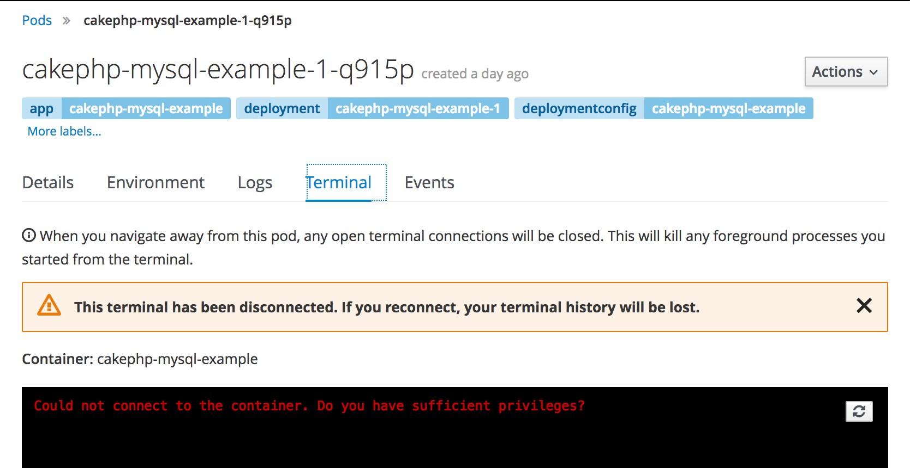

---
---
= Custom Role Creation
Andrew Block <ablock@redhat.com>
v1.0, 2017-03-324
:scripts_repo: https://github.com/rhtconsulting/rhc-ose
:toc: macro
:toc-title:
include::../../_includes/variables.adoc[]

OpenShift provides a fully functional link:{docs_url}architecture/additional_concepts/authorization.html[Role Based Access Control (RBAC)] system to govern the type of access users and groups have within the platform. While the platform does come with a series of roles that attempts to address the types of access applicable to the majority of users, there are cases in which a customization of the roles within OpenShift may be desired.

toc::[]

== Overview

The Role Based Access Controls within OpenShift gives platform administrators the tools to effectively govern the platform. Through the use of Roles, Policies and Bindings, operators can customize the level of access that are granted to each user of the platform. Access can be granted at a local (project) or cluster level. Several default roles are provided by the platform and include:

* admin
* basic-user
* cluster-admin
* cluster-status
* edit
* self-provisioner
* view

A full description of these roles and the concepts provided by roles can be found in the link:{docs_url}architecture/additional_concepts/authorization.html#roles[Roles] section of the documentation.

== Creating a Custom Role

One of the goals of OpenShift operators is to provide a secure platform, and in many cases requires customizing the default configuration. A common use case that is faced by many administrators is the need to restrict or disable functionality in order to support business requirements. This type of capability typically requires the creation of a custom role in order to restrict access to a particular component.

This section will describe the process for creating a role based on a particular business requirement.

=== Business Use Case for Custom Role Creation

The capability to gain access to a terminal shell within a running pod gives developers the ability to execute commands within running containers. However, certain organizations might want to restrict this functionality as accessing a running container may pose a security concern as actions may compromise the operation of the application.

=== Mechanisms for Restricting Access

The ability to perform certain actions, such as accessing a terminal session within a running application, is governed by the resources granted within Roles. Each resource corresponds to an endpoint registered with the OpenShift API. Along with each resource, the API verb, such as get, list, or create must be specified. The combination of a resource and a verb gives an entity the ability to perform an action against the OpenShift API. To restrict access to the terminal, the resource must not be present within a role associated with a user or group.

Since OpenShift already provides a set of default roles that fulfill the majority of the desired permission schemes, these can be used as a basis for any customized roles.

NOTE: It is recommended that the default roles remain unaltered and instead new roles providing customized permissions be created

=== Determine the Resource

The first step in restricting access to a particular function, the resource that provides the action must be determined. One of the methods in which to determine the resource is to increase the verbosity of the OpenShift Command Line (CLI) tool. Since every action (CLI or web console) makes use of the API, being able to trace the invocation affords the best opportunity to locate the resource.

Accessing a terminal within a pod is made possible using the Command Line Interface by the `oc rsh` command. Targeting a specific running pod, such as one with the name `sample-app-1-au4yj`, results in the following command to gain access to a terminal:

[source]
----
# oc rsh sample-app-1-au4yj
----

Any command executed in the CLI can be configured to include additional verbocity that can be used to debug each invocation by specifying the `--loglevel` argument. By specifying a _loglevel_ value of 8 of greater, the raw HTTP requests and responses against the API are shown. This is essential into tracing the invocations made by the CLI and determining the resources to restrict.

To determine the resource associated with the _rsh_ command, the following command can be executed against a running application:

[source]
----
# oc rsh sample-app-1-au4yj --loglevel=8
----

The response will be quite verbose, but the most important sections is the line containing the URL for the invocation:

[source]
----
I0330 18:17:51.112774   30905 round_trippers.go:296] POST https://openshift.example.com:8443/api/v1/namespaces/test-project/pods/sample-app-1-au4yj/exec?command=env&command=TERM%3Dxterm-256color&command=%2Fbin%2Fsh&container=sample-app&container=router&stdin=true&stdout=true&tty=true
----

By inspecting the URL used, the `pods/exec` can be seen as the resource that is used to acess a remote terminal session of a pod.

=== Create a new Cluster Role

Now that the resource that is desired to be restricted has been determined, the next step is to select one of the existing roles provided by OpenShift as the basis for a new role that can be implemented within any project. The majority of the default roles provided by OpenShift are bound at a cluster level and can be applied to any project. Since this is a similar pattern that would be desired for most custom roles, a new Cluster Role should be created based off an existing cluster role.

The edit role, which gives users the ability to view and modify most resources within a project, is a good use case in this scenario as it is commonly granted to most users within a project. As a platform administrator with cluster administrator access, export the existing _edit_ ClusterRole to a file on the local machine.

[source]
----
# oc export clusterrole edit > customrole.yaml
----

Next, open the _clusterrole.yaml_ file produced by the prior command to configure the new clusterrole without terminal functionality.

Give the new ClusterRole a name, such as edit_without_rsh

[source]
----
apiVersion: v1
kind: ClusterRole
metadata:
  creationTimestamp: null
  name: edit_without_rsh <1>
----
<1> Name of the new ClusterRole

Next, locate the _pods/exec_ resource within the existing role.

[source]
----
rules:
- apiGroups:
  - ""
  attributeRestrictions: null
  resources:
  - pods
  - pods/attach
  - pods/exec
  - pods/portforward
  - pods/proxy
  verbs:
  - create
  - delete
  - deletecollection
  - get
  - list
  - patch
  - update
  - watch
----

Remove the `- pods/exec` line and then save and then close the file.

NOTE: Since the API invocation against this endpoint was a POST, it makes use of the _create_ verb. There are many use cases where there is a desire to limit a portion of the available verbs, such as create, while still providing access to read, such as get and list verbs.

Finally create the new ClusterRole within OpenShift

[source]
----
# oc create -f clusterrole.yaml
----

=== Apply and Test the new ClusterRole

With the new ClusterRole configured within the cluster, it can be applied to users or groups.

To add the _edit_without_rsh_ role to another user, execute the following command:

[source]
----
# oc adm policy add-role-to-user edit_without_rsh <username> -n <project>
----

The user should now have access to the targeted project along with the ability to modify most resources. However, they will be unable to access the terminal tab from the web console or use the `oc rsh` command from the CLI. While navigating through the web console and selecting an individual pod, an error message will appear when attempting to select the *Terminal* tab.

A similar error will also appear when using the `oc rsh` command using the CLI

[source]
----
# oc rsh sample-app-1-au4yj
Error from server: User "<user>" cannot create pods/exec in project "<project>"
----
