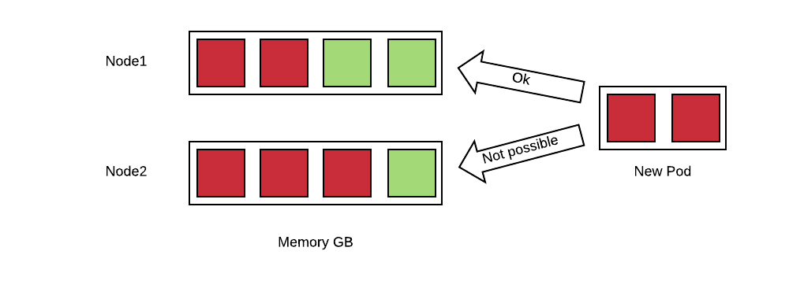

---
---
= How Full is my OpenShift Cluster?
Raffaele Spazzoli <rspazzol@redhat.com>
v1.0, 2017-08-28
:toc: macro
:toc-title:

toc::[]


= How Full is my OpenShift Cluster?

If you are in the early stages of your OpenShift implementation you may find it hard to answer this question: How full is my cluster? +
In this blog post I’ll try  to provide a very simple and quick way to answer this question,  something that you can use while you develop a more mature and comprehensive approach to monitoring OpenShift . +
But before that we need to make sure we understand the question.

== Quotas, Requests, Limits

https://docs.openshift.com/container-platform/latest/dev_guide/compute_resources.html#dev-quotas[Quotas], https://docs.openshift.com/container-platform/latest/dev_guide/compute_resources.html#dev-compute-resources[requests and limits] all play a role in the way OpenShift allocates resources and it can be easy to get them confused.  They are actually taken in consideration by OpenShift at different time and for different purposes. The following table summarizes these concepts:

|===
||*When it’s evaluated*|*Purpose*

|Quotas|Request time.|To limit how many resources a single tenant can request so that they cannot take over the cluster.
|Requests|https://docs.openshift.com/container-platform/latest/admin_guide/scheduler.htmls[Scheduling time].|Requests are used to choose which node is the best fit for the given workload (together with other criteria).
|Limits|Run time.|Limits are used to limit the maximum amount of resources that a container can use at runtime.
|===

=== Quotas


Quotas are attached to a project and have little to do with the real capacity of the cluster. But if a project reaches its quota, the cluster will not accept any additional requests from it, behaving as if it were full (notice that quotas can be attached to multiple projects with https://docs.openshift.com/container-platform/latest/admin_guide/multiproject_quota.html[multiproject quotas]).  

*Best Practice*: create T-shirt sized projects. By that I mean cluster administrators will define, via templates, a few standard sizes for projects where the size is determined by the associated quotas.

=== Requests

Requests are an estimate of what a container will consume when it runs. OpenShift uses this information to create a map of all the nodes and of how many resources they have available based on the containers that have been already allocated. Here is a simple example:




In this example, a new pod which is requesting 2GB of memory needs to be allocated to nodes with already committed memory. OpenShift can place this pod only on node1 because node2 does not have enough available resources. +
OpenShift can deny scheduling of pods if there is no node that can satisfy the request constraint. +
We can get an idea of how OpenShift estimates a node being utilized with the following command:  +
oc describe node <name of a node>

This will produce an output of the form (only the relevant fragments are reported): +
```
Allocatable: 
 alpha.kubernetes.io/nvidia-gpu:  0 
 cpu:         2 
 memory:        12304368Ki 
 pods:          20 
... 
Allocated resources: 
  (Total limits may be over 100 percent, i.e., overcommitted. 
  CPU Requests  CPU Limits  Memory Requests Memory Limits +
  ------------  ----------  --------------- ------------- 
  300m (15%)  400m (20%)  2660Mi (22%)  2248Mi (18%)
```
In this particular example, we have a node with 12GB of memory, of which 2.6GB are booked by requests coming from the 20 pods that are deployed.  +
Notice that this figure (22%) has nothing to do with the actual memory used on the node. This value represents the memory that has been reserved. The same applies to the CPU. +
Also, if you don’t specify what amount of resources you container needs, OpenShift assumes zero. This implies that if you don’t specify the requests for your containers, you can easily run out of resources while OpenShift will still think that all your nodes have capacity available.

*Best practice:* specify the request for all of your containers. You can mandate that requests for all your containers be specified by setting a min request in the limit range object associated to your projects, here is an example:

```
apiVersion: "v1" 
kind: "LimitRange" 
metadata: 
  name: "core-resource-limits"  
spec: 
  limits: 
    - type: "Container" 
      min: 
        cpu: "1m"  
        memory: "1Mi"
``` 
In the above example very small minimums are specified that will not affect the value of the requests for containers, but will make it mandatory to specify it.

It is also worth noting that in version 3.5, a link:https://docs.openshift.com/container-platform/latest/dev_guide/compute_resources.html#opaque-integer-resources[generalized framework for tracking additional node resources] has been introduced. These resources are called opaque integer resources and the main use case is to be able to track link:https://blog.openshift.com/use-gpus-openshift-kubernetes/[GPUs’ resources].

Every time OpenShift places a pod, it is solving an instance of a multidimensional link:https://en.wikipedia.org/wiki/Knapsack_problem[knapsack problem]. The knapsack problem is a classical problem in algorithm theory, where you have to place N stones of different sizes in M backpacks of different capacity. The point is to find optimal allocation. In the case of OpenShift we have a multidimensional knapsack problem because there are more that one characteristic to consider: CPU, memory and as we have seen opaque integer resources. +
The knapsack problem is a link:https://en.wikipedia.org/wiki/NP-completeness[np-complete] problem, which means that time needed to solve it scales exponentially with n (pods) and m (nodes). For this reason when n and m are big enough, a human cannot do a better job than a machine at solving this problem.

*Best Practice:* refrain from pinning pods to nodes using node selectors, because this interferes with the ability of OpenShift to optimize the allocation of pods and increase density. 

=== Limits

Limits determine the maximum amount of resources (CPU and/or memory) that can be used by a container at runtime. Setting a limit corresponds to passing to the docker run command the link:https://docs.docker.com/engine/reference/run/#/user-memory-constraints[*--memory*] parameter for memory limits and the link:https://docs.docker.com/engine/reference/run/#/cpu-quota-constraint[*--cpu-quota*] parameter for CPU limits. +
This influences the link:https://en.wikipedia.org/wiki/Cgroups[cgroup] that is created around the given container, limiting the resources it can use. +
For memory, docker assumes that if you ask for a given amount of RAM, you should also get twice as much swap size. This implies that if you have swap active, your container will actually see thrice as much memory as you have assigned to it, and it could potentially swap. 

*Best Practice*: link:https://docs.openshift.com/container-platform/3.5/admin_guide/overcommit.html#disabling-swap-memory[disable swap for nodes] (note that beginning with OpenShift 3.6, the node service will not start if swap is enabled).

Again if you don’t specify limits for your containers, then OpenShift assumes that they are unbounded and that the container can consume all the resources available on the node. +
To get an idea of the actual resources available in a node you can run (this command requires https://docs.openshift.com/container-platform/latest/install_config/cluster_metrics.html[cluster metrics] to be installed) +
`oc adm top node --heapster-namespace=openshift-infra --heapster-scheme=https <node-name>` +
Which will output something as follows: +
```
NAME             CPU(cores)   CPU%      MEMORY(bytes)   MEMORY%   
192.168.99.100   1007m        50%       5896Mi          49%
```

This is the same node of the above example. Notice that the actual consumption of resources is much higher than what OpenShift estimated. The difference is due to the fact that in this node there are several pods that do not declare requests and limits.

In summary, in order to fully being able to describe the available capacity of a cluster we should be able to answer two questions (and we need the answer them for at least memory and CPU):

 . How much capacity OpenShift estimates is available based on the declared requests by the pods.
 . How much capacity is really available based on current usage.

How well the actual resource availability tracks the OpenShift estimated availability will depend on how well the pods have been sized and on the current load.  +
Cluster administrators should watch the ratio between estimated resources and actual resources. They should also put in place policies to make sure that the two metrics stay as much as close as they can. This allows OpenShift to optimize allocation by increasing density, but at the same time guarantee the requested SLAs.

== Monitoring the cluster available capacity

Implementing a mature, enterprise-grade monitoring tool for OpenShift can take some time. I wanted to provide something that would allow to answer the resource availability question from day one. +
One way is to script the above commands (oc describe node and oc adm top) and come up with some calculation to get to the answer. Another way is to use https://github.com/hjacobs/kube-ops-view[Kube-ops-view]. A ported version to support OpenShift is available https://github.com/raffaelespazzoli/kube-ops-view/tree/ocp[here]. +
Kube-ops-view features a dashboard that allows to get information on the capacity of your cluster among other things. Here is an example of the dashboard:


The nice thing of kube-ops-view is that you don’t have to install anything on the nodes and you can run it all on your laptop. You can also install in your cluster. +
Kube-ops-view requires https://docs.openshift.com/container-platform/latest/install_config/cluster_metrics.html[metrics] to be installed and running correctly.

=== Running kube-ops-view on you laptop

For a local installation, you need to be logged in as a cluster administrator and then run the following: +
```
oc proxy &
docker run -it --net=host raffaelespazzoli/ocp-ops-view 
```

And the point your browser to http://localhost:8080/[http://localhost:8080]

=== Running Kube-ops-view in your cluster

An in-cluster installation allows you to make the console available to user who are not cluster-admin. +
You can install kube-ops-view in this mode by running the following:
```
oc new-project kube-ops-view 
oc create sa kube-ops-view 
oc adm policy add-cluster-role-to-user cluster-admin system:serviceaccount:kube-ops-view:kube-ops-view
oc apply -f https://raw.githubusercontent.com/raffaelespazzoli/kube-ops-view/ocp/deploy-openshift/kube-ops-view.yaml 
oc expose svc kube-ops-view 
oc get route | grep kube-ops-view | awk '{print $2}'
```
The application will be available at the url printed by the last command.

