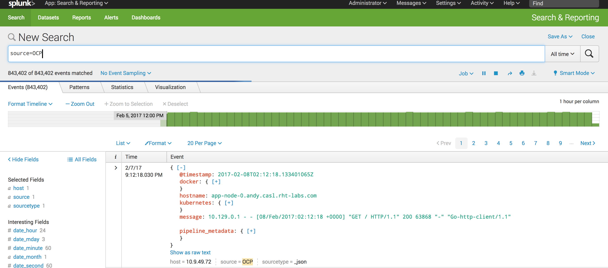

---
---
= Forwarding Logs to Splunk Using an External Containerized Fluentd Secure Forward
Karl Moos <moos@redhat.com>
v1.0, 2018-01-31
:scripts_repo: https://github.com/rhtconsulting/rhc-ose
:toc: macro
:toc-title:
include::../../_includes/variables.adoc[]

Send logs captured by the OpenShift Container Platform link:{docs_url}install_config/aggregate_logging.html[aggregated logging] solution to Splunk using a containerized implementation of link:https://github.com/fluent/data-collection/blob/master/output_plugins/out_secure_forward.md[Fluentd secure forward output plugin]

toc::[]

== Overview

OpenShift includes an aggregated logging solution consisting of link:https://www.elastic.co/[ElasticSearch], link:http://www.fluentd.org/[Fluentd], and link:https://www.elastic.co/products/kibana[Kibana] to consolidate messages produced by running applications along with cluster operations. In some cases, OpenShift may be deployed in an environment where an existing logging platform, such as Splunk, may already be deployed. The aggregated logging solution within OpenShift supports the ability to forward captured messages to Splunk through the Fluentd secure forward output plugin. The solution provides OpenShift cluster administrators the flexibility to choose the way in which logs will be captured, stored and displayed.

== Architecture

As part of the aggregated logging framework within OpenShift, containerized instances of Fluentd are deployed to OpenShift nodes as link:{docs_url}dev_guide/daemonsets.html[DaemonSets]. As messages are collected, Fluentd communicates with ElasticSearch to persistently store messages for later retrieval. Cluster administrators and users can browse, search, and view stored messages using Kibana, a web based user interface.

To support forwarding messages to Splunk that are captured by the aggregated logging framework, Fluentd can be configured to make use of the secure forward output plugin (already included within the containerized Fluentd instance) to send an additional copy of the captured messages outside of the framework. A separate instance of Fluentd must also be deployed in order to receive messages sent by secure forward plugin.  In this implementation, the separate Fluentd instance is containerized and running within OpenShift.  Once captured by the separate containerized Fluentd instance, messages can then be sent to Splunk.

image::images/logging-secure-forward-container-overview.png[title=Secure Forwarding to Splunk]

The remainder of this document describes the process for implementing the integrated logging framework with Splunk.

== Implementation

This section describes how to configure the OpenShift's integrated logging solution to forward logs to Splunk

=== Prerequisites

The following prerequisites are assumed and must be satisfied prior to implementing the solution

* A instance of Splunk following the link:http://docs.splunk.com/Documentation/Splunk/latest/Installation/[installation documentation]
** A preconfigured Splunk Docker image to use for testing can be found link:https://github.com/themoosman/docker-splunk/tree/master/enterprise[here]
* An OpenShift Container Platform cluster with aggregated logging installed

=== Configure Splunk

NOTE: If using the <<splunk-docker-image,preconfigured Docker image>>, this section can be skipped as these changes are already completed in the image.

To accept messages sent from the fluent-plugin-splunk-ex plugin, a new TCP based data input must be configured within Splunk.

As a Splunk user with administrative privileges, navigate to the Splunk user interface. Select *Settings* -> *Data Inputs* and then within the _Local Inputs_ section, select *Add new* next to the _TCP_ type.

Specify the following values to configure the TCP based Splunk input:

* Port: 9997
* Source name override: OCP
* Source Type: _json

NOTE: It is beyond the scope of this document for the creation of a custom link:https://docs.splunk.com/Splexicon%3ASourcetype[sourcetype] to perform advanced parsing of the data received.

Complete the necessary fields to finalize the addition of the new TCP input

NOTE: Open applicable firewall ports on the Splunk machine to allow for data to be received

Since the fluent-plugin-splunk-ex plugin sends data to Splunk in batches, Splunk must be configured to separate messages based on the presence of a new line character.

Configure the _/opt/splunk/apps/search/local/props.conf_ file with the following content which will configure messages received from the _OCP_ source to split messages correctly:

[source]
----
[source::OCP]
SHOULD_LINEMERGE = false
----

Restart Splunk to apply the changes:

[source]
----
systemctl restart splunk
----

=== Containerized Fluentd

A standalone instance of Fluentd serves as a broker between the OpenShift aggregated logging solution and Splunk. It receives messages sent by the secure forward plugin and forwards them to Splunk using the link:https://github.com/gtrevg/fluent-plugin-splunk-ex[fluent-plugin-splunk-ex] plugin.
In this implementation, the "external" fluentd instance will be run in OpenShift.

==== Source
The source code for the implementation can be found link:https://github.com/themoosman/openshift-fluentd-forwarder[here].

==== Clone the Git Repository

Clone the Git repository to the local file system.

[source]
----
cd ~/git
git clone https://github.com/themoosman/openshift-fluentd-forwarder.git
cd openshift-fluentd-forwarder
----

==== Create Fluentd Build Configuration

Create the fluentd-forwarder build configuration in the logging project.

[source]
----
oc project logging && \
oc process -f fluentd-forwarder-build-config-template.yaml \
-p GIT_URI=https://github.com/themoosman/openshift-fluentd-forwarder.git | oc create -f -
----

Build the Docker image in OpenShift and monitor for any errors.

[source]
----
oc start-build fluentd-forwarder --follow=true
----

==== Create Fluentd Deployment Configuration

Create the fluentd-forwarder deployment configuration in the logging project.

[source]
----
oc project logging && \
oc process -f fluentd-forwarder-template.yaml \
-p "P_TARGET_TYPE=splunk_ex" \
-p "P_TARGET_HOST=10.10.10.10" \ <1>
-p "P_TARGET_PORT=9997" \ <2>
-p "P_SHARED_KEY=ocpaggregatedloggingsharedkey" <3>
-p "P_ADDITIONAL_OPTS=output_format json" | <4>
oc create -f -
----
<1> IP address of the Splunk server.
<2> Port of the Splunk server.
<3> A shared value between the sender and the receiver.
<4> Set fluentd to format all logs sent to Splunk in a JSON format.

Rollout the latest fluentd-forwarder deployment configuration.

[source]
----
oc rollout latest dc/fluentd-forwarder
----

Validate that the fluentd-forwarder deploys successfully.

==== Update logging-fluentd ConfigMap

The `logging-fluentd` configmap's `data.secure-forward.conf` key needs to be edited as well.

[source]
----
oc edit configmap -n logging logging-fluentd
----

Edit the following YAML:

[source]
----
data:
  secure-forward.conf: |
    <store>
    @type secure_forward

    self_hostname ${HOSTNAME}
    shared_key ocpaggregatedloggingsharedkey <1>

    secure yes
    enable_strict_verification yes

    ca_cert_path /var/run/secrets/kubernetes.io/serviceaccount/service-ca.crt

    <server>
       host fluentd-forwarder.logging.svc.cluster.local
       port 24284
    </server>
    </store>
----
<1> A shared value between the sender and the receiver.  This must match the value specified above.

This will cause each individual fluentd logger to begin forwarding to the service address fluentd-forwarder.logging.svc.cluster.local which was created with the new-app command. That service has it's own cluster-generated certificates and the "ca_cert_path" value here is used to trust the cluster's service signer CA.

After saving the above changes the logging-fluentd pods need to be restarted. Delete them and they will be recreated.

[source]
----
oc delete pod -l component=fluentd
----

== Verification

At this point, messages captured by the OpenShift integrated logging solution should now be sent to Splunk and available within the Splunk user interface.

The following steps can be used to verify the integration between OpenShift and Splunk using the secure forward plugin

=== Splunk Docker Image

A preconfigured Docker image is available to aid in testing.  This image must be launched using Docker either on a test machine or within the cluster.

==== Build Docker Image

To build the Docker Image clone the link:https://github.com/themoosman/docker-splunk[docker repo].

[source]
----
cd ~
git clone https://github.com/themoosman/docker-splunk.git
cd docker-splunk/enterprise

docker build . ocp-test-splunk
----

==== Launch Splunk Container

[source]
----
docker run --name splunk --hostname splunk -p "8000:8000" -p "9997:9997" -d -e "SPLUNK_START_ARGS=--accept-license"  ocp-test-splunk
----

=== OpenShift Fluentd

The communication between the Fluentd pods running within OpenShift and the standalone Fluentd instance can be validated by viewing the logs in any one of the running pods.

Locate a running Fluentd pod within the project containing the logging infrastructure:

[source]
----
oc get pods -l component=fluentd

NAME                    READY     STATUS    RESTARTS   AGE
logging-fluentd-9z0ye   1/1       Running   0          2d
logging-fluentd-a4utk   1/1       Running   0          2d
logging-fluentd-hypzv   1/1       Running   0          2d
logging-fluentd-t3wqx   1/1       Running   0          2d
logging-fluentd-zt92l   1/1       Running   0          2d
----

View the logs of one of the running containers:

[source]
----
oc logs logging-fluentd-9z0ye
----

A result similar to the following indicates there are no communication issues between OpenShift and the standalone instance of Fluentd:

[source]
----
2017-02-05 08:48:38 -0500 [info]: reading config file path="/etc/fluent/fluent.conf"
----

=== Standalone Fluentd

The standalone instance of Fluentd can be validated by viewing the logs in OpenShift. The following indicates no issues can be seen within Fluentd

[source]
----
Using OpenShift ConfigMap configuration
2018-01-31 16:52:26 +0000 [info]: reading config file path="/etc/fluent/fluentd.conf"
2018-01-31 16:52:26 +0000 [info]: starting fluentd-0.12.32
2018-01-31 16:52:26 +0000 [info]: gem 'fluent-plugin-kubernetes_metadata_filter' version '1.0.1'
2018-01-31 16:52:26 +0000 [info]: gem 'fluent-plugin-record-modifier' version '0.6.2'
2018-01-31 16:52:26 +0000 [info]: gem 'fluent-plugin-remote_syslog' version '1.0.0'
2018-01-31 16:52:26 +0000 [info]: gem 'fluent-plugin-rewrite-tag-filter' version '1.6.0'
2018-01-31 16:52:26 +0000 [info]: gem 'fluent-plugin-secure-forward' version '0.4.5'
2018-01-31 16:52:26 +0000 [info]: gem 'fluent-plugin-splunk-ex' version '1.0.2'
2018-01-31 16:52:26 +0000 [info]: gem 'fluentd' version '0.12.32'
2018-01-31 16:52:26 +0000 [info]: gem 'fluentd' version '0.10.62'
2018-01-31 16:52:26 +0000 [info]: adding filter pattern="**" type="record_transformer"
2018-01-31 16:52:26 +0000 [info]: adding filter pattern="**" type="grep"
2018-01-31 16:52:26 +0000 [info]: adding match pattern="**" type="splunk_ex"
2018-01-31 16:52:26 +0000 [info]: adding source type="secure_forward"
----

=== Splunk

Finally, validate that messages are making their way to Splunk. Since the TCP input was configured to mark each message originating from OpenShift with the source value of *OCP*, perform the following query in the Splunk search dashboard:

[source]
----
source=OCP
----

A successful query will yield results similar to the following:

