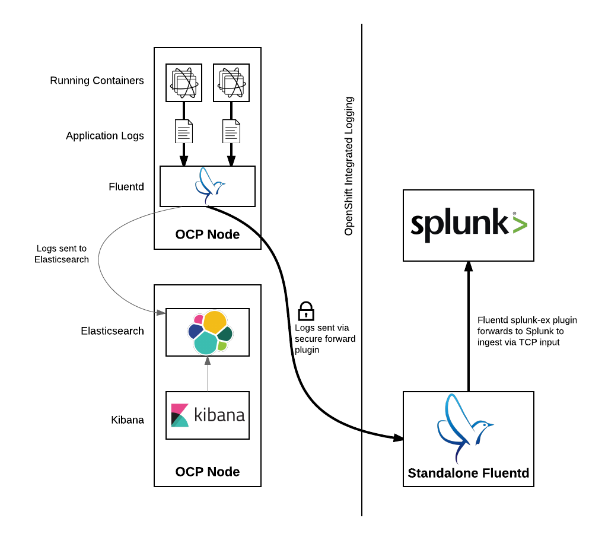
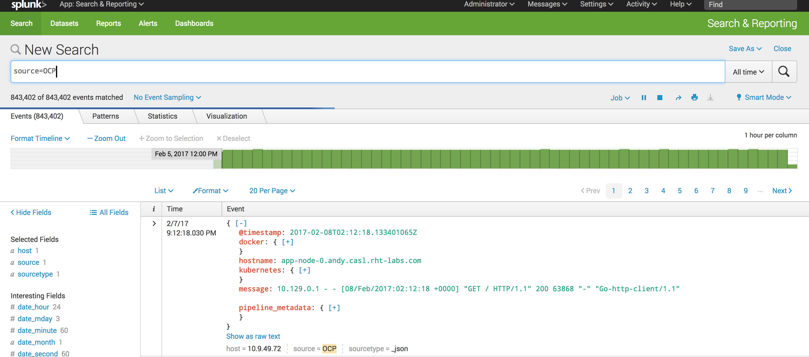

---
---
= Forwarding Logs to Splunk Using Fluentd Secure Forward
Andrew Block <ablock@redhat.com>
v1.0, 2017-02-05
:scripts_repo: https://github.com/rhtconsulting/rhc-ose
:toc: macro
:toc-title:

Send logs captured by the OpenShift Container Platform link:https://docs.openshift.com/container-platform/latest/install_config/aggregate_logging.html[aggregated logging] solution to Splunk using the link:http://docs.fluentd.org/v0.12/articles/out_secure_forward[Fluentd secure forward output plugin]

toc::[]

== Overview

OpenShift includes an aggregated logging solution consisting of link:https://www.elastic.co/[ElasticSearch], link:http://www.fluentd.org/[Fluentd], and link:https://www.elastic.co/products/kibana[Kibana] to consolidate messages produced by running applications along with cluster operations. In some cases, OpenShift may be deployed in an environment where an existing logging platform, such as Splunk, may already be deployed. The aggregated logging solution within OpenShift supports the ability to forward captured messages to Splunk through the Fluentd secure forward output plugin. The solution provides OpenShift cluster administrators the flexibility to choose the way in which logs will be captured, stored and displayed.

== Architecture

As part of the aggregated logging framework within OpenShift, containerized instances of Fluentd are deployed to OpenShift nodes as link:https://docs.openshift.com/container-platform/latest/dev_guide/daemonsets.html[DaemonSets]. As messages are collected, Fluentd communicates with ElasticSearch to persistently store messages for later retrieval. Cluster administrators and users can browse, search and view stored messages using Kibana, a web based user interface.

To support forwarding messages to Splunk that are captured by the aggregated logging framework, Fluentd can be configured to make use of the secure forward output plugin (already included within the containerized Fluentd instance) to send an additional copy of the captured messages outside of the framework. A separate instance of Fluentd must also be deployed in order to reveive messages sent by secure forward plugin. Once captured by the separate Fluentd instance, messages can then be sent to Splunk.

The remainder of this document describes the process for implementing the integrated logging framework with Splunk.

== Implementation

This section describes how to configure the OpenShift's integrated logging solution to forward logs to splunk

=== Prerequisites

The following prerequisites are assumed and must be satisfied prior to implementing the solution

* 2 dedicated machines
** A instance of Splunk following the link:http://docs.splunk.com/Documentation/Splunk/latest/Installation/[installation documentation]
** A machine for running a standalone instance of Fluentd
* An OpenShift Container Platform cluster with aggregated logging installed

=== Configure Splunk

To accept messages sent from the fluent-plugin-splunk-ex plugin, a new TCP based data input must be configured within Splunk.

As an Splunk user with administrative privileges, navigate to the Splunk user interface. Select *Settings* -> *Data Inputs* and then within the _Local Inputs_ section, select *Add new* next to the _TCP_ type. 

Specify the following values to configure the TCP based Splunk input:

* Port: 9997
* Source name override: OCP
* Source Type: _json

NOTE: It is beyond the scope of this document for the creation of custom link:https://docs.splunk.com/Splexicon:Sourcetype[sourcetype's] to perform advanced parsing of the data received.

Complete the necessary fields to finalize the addition of the new TCP input

NOTE: Open applicable firewall ports on the Splunk machine to allow for data to be received 

Since the fluent-plugin-splunk-ex plugin sends data to Splunk in batches, Splunk must be configured separate messages based on the presence of a new line character.

Configure the _/opt/splunk/apps/search/local/props.conf_ file with the following content which will configure messages received from the _OCP_ source to split messages correctly:

[source]
----
[source::OCP]
SHOULD_LINEMERGE = false
----

Restart Splunk to apply the changes

[source]
----
systemctl restart splunk
----

=== Standalone Fluentd

A standalone instance of Fluentd serves as a broker between the OpenShift aggregated logging solution and Splunk. It receives messages sent by the secure forward plugin and forwards them to Splunk using the link:https://github.com/gtrevg/fluent-plugin-splunk-ex[fluent-plugin-splunk-ex] plugin.

==== Install Fluentd

Fluentd can be installed on a RHEL machine by running the following command:

[source]
----
curl -L https://toolbelt.treasuredata.com/sh/install-redhat-td-agent2.sh | sh
----

With the installation successfully completed, enable the *td-agent* service to be started at boot and start the service

[source]
----
service start td-agent
chkconfig td-agent on
----

==== Install Fluentd Plugins

Two Fluentd plugins must be installed to receive and forward messages from OpenShift's aggregated logging framework to splunk:

* Secure forward plugin
* Fluentd extended Splunk plugin

Execute the following commands to install the two plugins

[source]
----
/opt/td-agent/embedded/bin/fluent-gem install fluent-plugin-secure-forward
/opt/td-agent/embedded/bin/gem install fluent-plugin-splunk-ex
----

==== Generate Certificates

Since the secure forward plugin makes use of SSL as its primary transport mechanism, certificates must be configured to secure the communication channel between OpenShift and the standalone Fluentd instance. There are multiple ways in which the certificates can be provided. The most common methods include using a signed certificate from a trusted public certificate authority (CA) or to generate certificates using a private CA.

For demonstration purposes, a private CA will be utilized. The plugin includes a tool called _secure-forward-ca-generate_ to generate the certificate and private key. Execute the following command to generate new certificates in a folder called _/etc/td-agent/certs/_ using a password protected private key with the value _ocpsecureforward_. 

[source]
----
/opt/td-agent/embedded/bin/secure-forward-ca-generate /etc/td-agent/certs/ ocpsecureforward
----

CAUTION: Be sure to specify a unique private key password for your own environment

==== Configure Fluentd

Finally, add the settings for both plugins to the Fluentd configuration file located at _/etc/td-agent/td-agent.conf_

[source]
----
<source>
  @type secure_forward
  self_hostname "#{ENV['HOSTNAME']}"
  bind 0.0.0.0
  port 24284 <1>

  shared_key ocpaggregatedloggingsharedkey <2>

  secure yes
  cert_path        /etc/td-agent/certs/ca_cert.pem <3>
  private_key_path /etc/td-agent/certs/ca_key.pem <4>
  private_key_passphrase ocpsecureforward <5>
</source>

<match **>
   type splunk_ex
   host 10.9.49.71 <6>
   port 9997 <7>
   output_format json <8>
</match>
----
<1> Port to accept incoming logs
<2> A shared value between the sender and the receiver
<3> Location of the previously generated certificate
<4> Location of the previously generated private key
<5> Private key passphrase
<6> Hostname or IP of the Splunk instance
<7> Port number of the Splunk input configured to accept messages
<8> Format in which messages are sent to Splunk

NOTE: To allow messages to be received on port 24284 for the secure forward plugin, ensure the proper firewall configurations are in place

Restart the _td-agent_ service to apply the changes

[source]
----
systemctl restart td-agent
----

=== OpenShift Aggregated Logging

Once Splunk and the standalone instance of Fluentd have been configured, OpenShift's aggregated logging framework can be configured to securely forward messages externally.

==== Configure Certificates

As previously configured, certificates were generated and implemented in the standalone Fluentd instance to provide secure communication for the secure forward plugin between Fluentd running on each node in OpenShift and the standalone Fluentd instance. The same certificates need to now be configured in OpenShift.

Copy the files from the _/etc/td-agent/certs/_ folder to a location on your local machine. 

Login to the OpenShift environment as a user with privileges to modify the logging infrastructure and change to the _logging_ project:

[source]
----
oc login <openshift_master_address>
oc project logging
----

A secret called _logging-fluentd_ are already configured within the logging infrastructure in order to communicate with elastic search. Patch the existing secret to include the certicate and private key copied from the standalone Fluentd instance.

[source]
----
oc patch secrets/logging-fluentd --type=json --patch "[{'op':'add','path':'/data/external_ca_cert.pem','value':'$(base64 /path/to/your_ca_cert.pem)'}]"
oc patch secrets/logging-fluentd --type=json --patch "[{'op':'add','path':'/data/external_ca_key.pem','value':'$(base64 /path/to/your_private_key.pem)'}]"
----

[NOTE]
====
The names external_ca_cert.pem and external_ca_key.pem provided in the code sample are the key names configured within the patched secret

The base64 utility must be present on the machine executing the commands
====

==== Configuring Fluentd

A link:https://docs.openshift.com/container-platform/latest/dev_guide/configmaps.html[ConfigMap] called _logging-fluentd_ is configured within the aggregated logging framework to specify the values to containing the configurations for Fluentd. Multiple files are containing within the ConfigMap, including a file called _secure-forward.conf_. The contents of this file are commented out as secure forward plugin is not enabled by default.

Edit the secure-forward.conf file contained within the ConfigMap using the command `oc edit configmap logging-fluentd` with the following content:

[source]
----
  secure-forward.conf: |
    @type secure_forward

    self_hostname "#{ENV['HOSTNAME']}"
    shared_key ocpaggregatedloggingsharedkey <1>

    secure yes
    # enable_strict_verification yes

    ca_cert_path /etc/fluent/keys/external_ca_cert.pem <2>
    ca_private_key_path /etc/fluent/keys/external_ca_key.pem <3>
    ca_private_key_passphrase ocpsecureforward <4>

    <server>
      host 10.9.49.72 <5>
      port 24284 <6>
    </server>
----
<1> Value shared between both ends of the secure forward plugin
<2> Location of the certificate used by the secure forward plugin
<3> Location of the private key used by the secure forward plugin
<4> Privae key passphrase
<5> Hostname or IP address of the standalone Fluentd instance
<6> Port number of the standalone Fluentd instance

Note: It is recommended the enable_strict_verification option be uncommented to increase security between each endpoint of the secure forward plugin. This FQDN of the target instance to match the value configured in the certificates used to secure the communication channel.

==== Applying the changes

Finally, since a portion of the Fluentd configuration involved the modification of secrets, the existing Fluentd pods will need to be deleted in order for them to make use of the updated values.

Execute the following command to remove the existing Fluentd pods

[source]
----
oc delete pod -l component=fluentd
----

The DaemonSet will automatically start pods on the nodes in which they were previously deleted. 

== Verification

At this point, messages captured by OpenShift integrated logging solution should now be sent to Splunk and available within the Splunk user interface.

The following steps can be used to verify the integration between OpenShift and Splunk using the secure forward plugin

=== OpenShift Fluentd

The communication between the Fluentd pods running within OpenShift and the standalone Fluentd instance can be validated by viewing the logs in any one of the running pods. 

Locate a running Fluentd pod within the project containing the logging infrastructure

[source]
----
oc get pods -l component=fluentd

NAME                    READY     STATUS    RESTARTS   AGE
logging-fluentd-9z0ye   1/1       Running   0          2d
logging-fluentd-a4utk   1/1       Running   0          2d
logging-fluentd-hypzv   1/1       Running   0          2d
logging-fluentd-t3wqx   1/1       Running   0          2d
logging-fluentd-zt92l   1/1       Running   0          2d
----

View the logs of one of the running containers:

[source]
----
oc logs logging-fluentd-9z0ye
----

A result similar to the following indicates there are no communication issues between OpenShift and the standalone instance of Fluentd

[source]
----
2017-02-05 08:48:38 -0500 [info]: reading config file path="/etc/fluent/fluent.conf"
----

=== Standalone Fluentd

The standalone instance of Fluentd can be validated by viewing the systemd journal for the _td-agent_ service. The following indicates no issues can be seen within Fluentd

[source]
----
Feb 04 23:23:08 poc-ocp-logging-fluentd.localdomain systemd[1]: Starting LSB: data collector for Treasure Data...
Feb 04 23:23:08 poc-ocp-logging-fluentd.localdomain runuser[19753]: pam_unix(runuser:session): session opened for user td-agent by (uid=0)
Feb 04 23:23:08 poc-ocp-logging-fluentd.localdomain td-agent[19740]: [44B blob data]
Feb 04 23:23:08 poc-ocp-logging-fluentd.localdomain systemd[1]: Started LSB: data collector for Treasure Data.
----

=== Splunk

Finally, validate that messages are making their way to Splunk. Since the TCP input was configured to mark each message originating from OpenShift with the source value of *OCP*, perform the following query in the Splunk search dashboard:

[source]
----
source=OCP
----

A successful query will yield results similar to the following:

