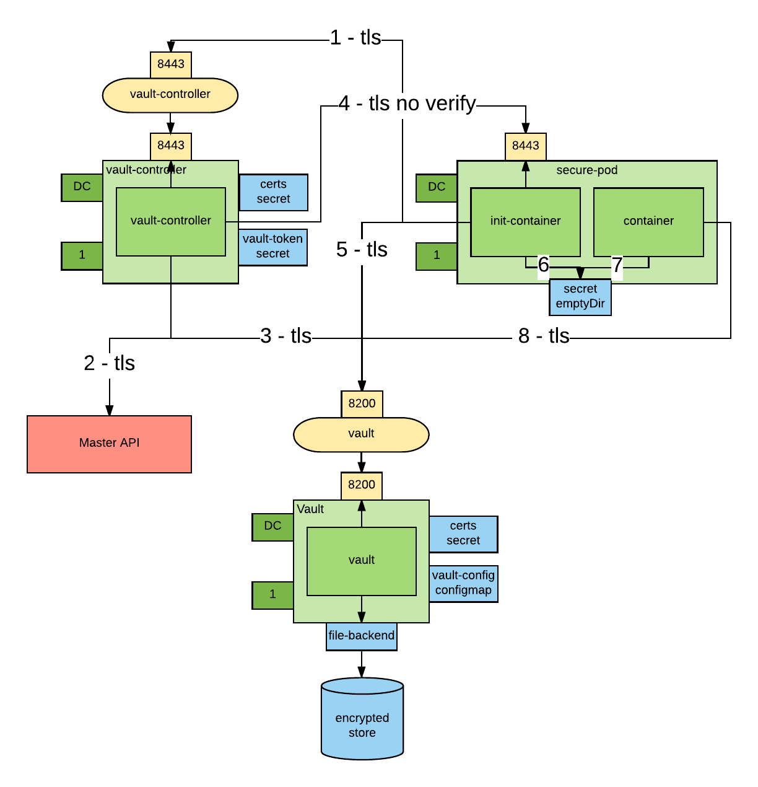

---
---
= Vault Integration with OpenShift
Red Hat Containers & PaaS CoP
v1.0, 2017-05-18
:scripts_repo: https://github.com/rhtconsulting/rhc-ose
:toc: macro
:toc-title:

toc::[]


== Introduction
Credentials are link:https://blog.openshift.com/environment-dependent-property-management-strategies-openshift-pipelines/[environment dependent configurations] that need to be kept secret and should be read only by subjects with a need-to-know.

This blog post talks about how to manage environment dependent configuration when building delivery pipelines, these approaches are not adequate for secrets because they don’t guarantee confidentiality.

OpenShift offers link:https://docs.openshift.com/container-platform/latest/dev_guide/secrets.html[secrets] as a way to inject credentials. Secrets behaves as encoded-64 link:https://docs.openshift.com/container-platform/latest/dev_guide/configmaps.html[configmaps]. From a security perspective they have the following limitations (as of release 3.5):

 . They are not encrypted at rest.
 . By default cluster admins can see all the secrets of all the tenants.
 . When in use (i.e. mounted as tempfs in the node that runs the pod that is using them), they can be seen by a node administrator.
 . When in use, they can be seen by anyone who has the ability to remote shell in the container.

If your organization can accept these limitations, I encourage you to use secrets because I believe that they will get better in future releases of OpenShift.

If your organization can not work with the current OpenShift secret feature, then you need to find another way to inject credentials in your pods.

In this article I present an integration with link:https://www.vaultproject.io/[Vault] from link:https://www.hashicorp.com/[HashiCorp] to solve this problem. This orchestration was built on the work previously done by link:https://github.com/kelseyhightower/vault-controller[Kelsey Hightower].

== The Vault
Vault is a secret store software. It can be used to safely store and manage credentials. Other examples can be found link:https://gist.github.com/maxvt/bb49a6c7243163b8120625fc8ae3f3cd[here]. I think that two things distinguish Vault from the rest of the crowd:

 * It is designed to be run in the cloud.
 * It has the concept of link:https://www.vaultproject.io/docs/secrets/index.html[managed backends]. A backends can be anything that requires a credentials (such as mysql). Vault will create and rotate credentials for any managed backend.

Managed credential makes Vault interesting for those scenarios where high automation is required, while at the same time strict security requirements on credential management need to be enforced.

== Credential Management Orchestration
There are four actors in the orchestration that injects credentials in an OpenShift pod:

 . The Vault instance.
 . The Vault Controller. The Vault controller is a trusted intermediary and has high privileges with Vault. In fact the Vault Controller can create new Vault tokens.
 . An link:https://docs.openshift.com/container-platform/latest/architecture/core_concepts/containers_and_images.html[Init Container]. Init Containers are containers that are run before the main container of a pod is started. Their job is to set up the right environment for the main container. The design decision is to put the Vault orchestration logic in an Init Container so not to  have to add behavior to the main container and therefore have greater reusability of existing images.
 . The main container that needs the credentials.

The below picture represents the orchestration:



 . An Init Container requests a link:https://www.vaultproject.io/docs/concepts/response-wrapping.html[wrapped token] from the Vault Controller over an encrypted connection. Wrapped credentials allow you to pass credentials around without any of the intermediaries having to actually see the credential.
 . The Vault Controller retrieves the Pod details from the Kubernetes API server.
 . If the Pod exists and contains the `vaultproject.io/policies` annotation, the Vault Controller calls Vault and generates a unique wrapped token with access to the link:https://www.vaultproject.io/docs/concepts/policies.html[Vault policies] mentioned in the annotation. This step requires trust on pod author to have used to right policies. The generated token has a configurable link:https://www.vaultproject.io/docs/concepts/lease.html[TTL].
 . The Vault Controller "calls back" the Init Container using the Pod IP obtained from the Kubernetes API over an encrypted connection and delivers it the newly created wrapped token. Notice that the Vault Controller does not trust the pod, it only trusts the master API.
 . The Init Container unwraps the token to obtain a the Vault token that will allow to access the credentials.
 . The Vault token is written to a well-known location in a volume shared between the two containers (link:https://kubernetes.io/docs/concepts/storage/volumes/#emptydir[emptyDir]) and the Init Container exits.
 . The main container reads the token from the token file. Now the main container can use the token to retrieve all the secrets allowed by the policies considered when the token was created.
 . If needed the main container renews the token to keep it from expiring.

This integration mitigates some of the attack vector that we have seen before, in fact:
 . Credentials are encrypted at rest in Vault
 . No OpenShift cluster admin can see the credentials, plus in vault you can create link:https://www.vaultproject.io/docs/concepts/seal.html[sharded master keys], so that no Vault admin can by themselves unencrypt the credentials.
 . The token used to connect to Vault has a short TTL. It the responsibility of the pod consuming the token to renew it before it expires. So, the token persisted on the file system can only be used for a short time mitigating the risk that someone reads it (either node administrator or user rsh-ing in the container). The application consuming the token may also choose to delete the token after it reads it, further mitigating the risk.

A variation to this use case is also supported for legacy application.
In this case the Init Container not only unwraps the token, but it also uses the unwrapped token to retrieve a secret (which must be static because no further communication with Vault will occur). As before the secret is written to a well know location, so the main container can use it.
In this case the secret is still vulnerable to being viewed by node administrators or user with the ability to remote shell in the containers.

The following table summarizes the threat model:

[cols="4*", options="header"]
|===
|Attack Vector
|Vault Aware App
|Legacy app
|OpenShift Secrets

|reading secrets at rest
|ok
|ok
|no

|reading secrets in transit
|ok
|ok
|ok

|reading secrets via the API
|ok
|ok
|no

|reading secrets in use from within the container (rsh)
|ok
|no
|no

|reading secrets in use from the node
|ok
|no
|no
|===

== Installing the Vault Infrastructure
Clone this repository

```
git clone https://github.com/raffaelespazzoli/credscontroller
cd credscontroller
```

=== Create a New Project
```
oc new-project vault-controller
```

=== Install Vault
```
oc adm policy add-scc-to-user anyuid -z default
oc create configmap vault-config --from-file=vault-config=./openshift/vault-config.json
oc create -f ./openshift/vault.yaml
oc create route passthrough vault --port=8200 --service=vault
```

=== Initialize Vault
```
export VAULT_ADDR=https://`oc get route | grep -m1 vault | awk '{print $2}'`
vault init -tls-skip-verify -key-shares=1 -key-threshold=1
```

=== Unseal Vault
You have to repeat this step every time you start vault.
Don't try to automate this step, this is manual by design.
You can make the initial seal stronger by increasing the number of keys.
We will assume that the KEYS environment variable contains the key necessary to unseal the vault and that ROOT_TOKEN contains the root token.

For example:

```
export KEYS=9++8KEDd72S3aGc0zaY9JW11tnQRDTEkCZWMHK2D0CM=
export ROOT_TOKEN=c30909da-a713-94bf-bf6e-46180ef79a64
vault unseal -tls-skip-verify $KEYS
```

=== Install Vault Controller
```
oc create secret generic vault-controller --from-literal vault-token=$ROOT_TOKEN
oc adm policy add-cluster-role-to-user view system:serviceaccount:vault-controller:default
oc create -f ./openshift/vault-controller.yaml
```

== Running the Example
At this point you are ready to start deploying pods that use this approach to inject secrets.
The repository comes with two examples; one for a link:https://github.com/raffaelespazzoli/credscontroller/tree/master/examples/spring-example[Vault aware application] and one for a link:https://github.com/raffaelespazzoli/credscontroller/tree/master/examples/spring-legacy-example[legacy application].
Here are the instructions to run the vault aware example.
In this first example a link:https://projects.spring.io/spring-boot/[Spring Boot] app uses the Spring link:https://github.com/spring-cloud/spring-cloud-vault[cloud vault configuration plugin] to get part of its configuration from Vault.
The Init Container will write the unwrapped Vault token to a well know location, the app will use that token to authenticate with Vault and retrieve its credentials.

=== Create the Vault Policy
We need to create a policy that will allow to access a specific subset of secrets. This is how you can have multiple application storing their secrets in Vault.

```
export VAULT_TOKEN=$ROOT_TOKEN
vault policy-write -tls-skip-verify spring-example ./examples/spring-example/spring-example.hcl
```

=== Create the Secret
We now store a static secret in Vault

```
vault write -tls-skip-verify secret/spring-example password=pwd
```

=== Build the Application
```
oc new-project spring-example
oc new-build registry.access.redhat.com/redhat-openjdk-18/openjdk18-openshift~https://github.com/raffaelespazzoli/credscontroller --context-dir=examples/spring-example --name spring-example
```

=== Allow the Application to Talk to Vault and Vault Controller
You need to execute this step only if you are running in a multi-tenant OpenShift

```
oc adm pod-network join-projects --to vault-controller spring-example
```

=== Deploy the Application
```
oc create -f ./examples/spring-example/spring-example.yaml
oc expose svc spring-example
```

=== Verify the Application
The last command should return the secret that was initially stored in Vault.

```
export SPRING_EXAMPLE_ADDR=http://`oc get route | grep -m1 spring | awk '{print $2}'`
curl $SPRING_EXAMPLE_ADDR/secret
```
