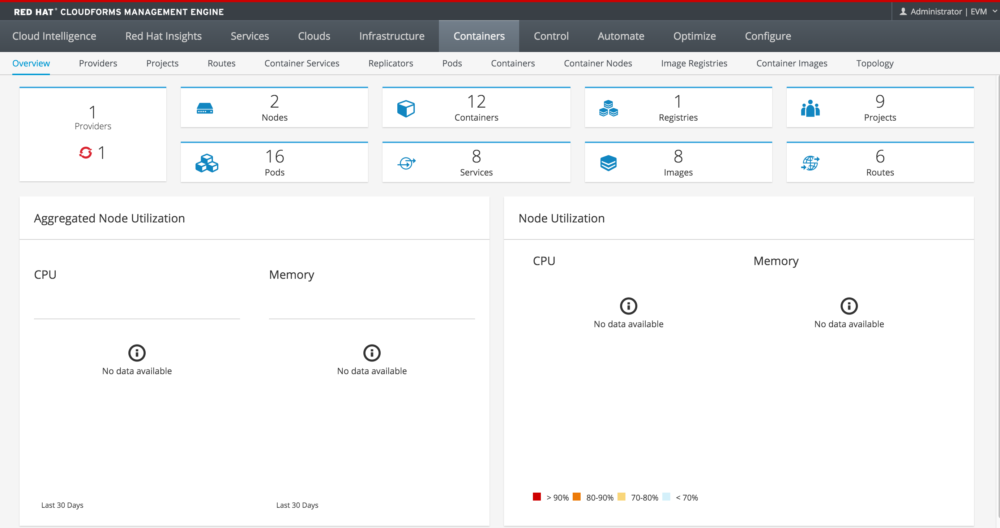
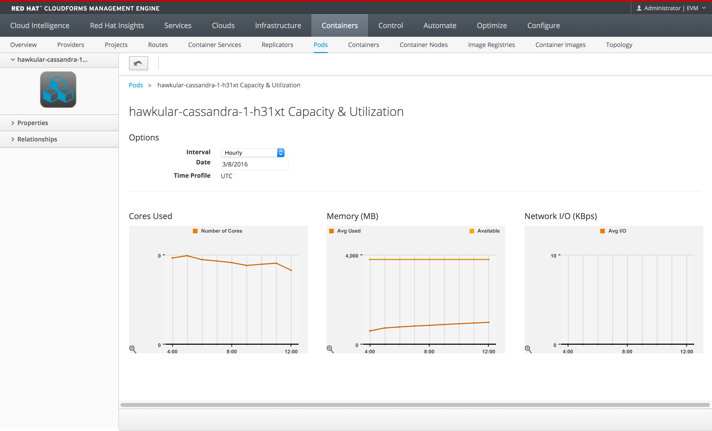

= CloudForms Integration with OpenShift Enterprise v3
Andrew Block <ablock@redhat.com>
v1.0, 2016-03-05
:scripts_repo: https://github.com/rhtconsulting/rhc-ose
:toc: macro
:toc-title:

Beginning with version 3.1, OpenShift officially supported integration with CloudForms 4 to provide a single pane of glass over the OpenShift environment.  

toc::[]

== CloudForms Environment Sizing

The following are several machine profiles for deploying a CloudForms environment. Be sure to adjust based on the expected environment requirements. A full guide for planning a CloudForms environment planning can be found in this https://access.redhat.com/documentation/en/red-hat-cloudforms/version-4.0/deployment-planning-guide/[document].

The following are sample environment sizes that be applied to CloudForms:

=== Standard Environment
* 6 Appliances
** Database (1x)
*** 4 vCPU
*** 16 GB RAM
*** /dev/sda 50-100GB (Block device for Postgres)
** Web UI (2x - Can reduce to 1)
*** 4 vCPU
*** 8 GB RAM
*** /dev/sda 40GB (Default for OVA)
** Workers (3x - Can reduce to 2)
*** 4 vCPU
*** 8 GB RAM
*** /dev/sda 40GB (Default for OVA)

=== Minimal Environment (All in One)

* 4 vCPU
* 8GM RAM
* Disk
** /dev/sda 40GB (Default for OVA)
** /dev/sdb 40GB (Block device for Postgres)

== CloudForms Installation

The CloudForms appliance is delivered as a virtual image template that can be installed on several platforms including OpenStack, Red Hat Enterprise Virtualization and in the VMWare vSphere environment. Consult the link:https://access.redhat.com/documentation/en/red-hat-cloudforms/[installation documentation] for platform specific directions outside of the materials provided here.

Configure CloudForms and database connectivity according to the documentation and to your specific environment. 

At a minimum, this requires the following steps:

* 2. Set static network configuration
* 5. Configure Timezone, Date and Time
* 8. Configure Database

Once the configurations have been applied, select option 15 to apply the changes and to restart the VM

For installations with more than one appliance, repeat the above steps making sure to join an existing database cluster when completing step 8. 

Once the machine reboots, the web console should be accessible at the host public ip.

https://<public_host>

The default username/password combination is admin/smartvm

After logging into the console, configure basic server settings by select the *configure* tab and then the *configuration* sub tab. 

Set the *Company Name* to customize the name of the organization. Next, specify the *Appliance Name* as the value that should be visible on the appliance that is logged into. 

Under the _Server Control_ section, apply the following roles based on the appliance type:

.Server Roles
[options="header,footer"]
|=======================
|Role|Appliance Type
|Automation Engine    |Worker, UI
|Capacity and Utilization (3 Roles) |Worker UI
|Database Operations    |DB
|Database Synchronization    |DB
|Event Monitor    |Worker
|Provider Inventory    |Worker
|Provider Operations    |Worker
|Notifier    |Worker, UI
|Reporting    |UI
|RHT Mirror    |UI
|Scheduler    |Worker, UI
|SmartProxy    |Worker
|SmartState Analysis    |Worker
|User Interface    |Worker, UI, DB
|Web Services    |DB
|=======================

== OpenShift Configuration

In OpenShift 3.1, a new built in project called _management-infra_ is available to allow integration with third party tools, such as CloudForms. This project provides a management service account named _management-admin_ which can be used to allow third party tools to communicate with OpenShift. You are also free to utilize another service account instead of the default if desired. 

NOTE: Newer versions of the https://github.com/openshift/openshift-ansible[openshift-ansible] playbooks configure the _management-infra_ project automatically. Otherwise, please see the _Configuring Service Accounts_ section of this https://access.redhat.com/documentation/en/red-hat-cloudforms/4.0/managing-providers/chapter-3-containers-providers#adding_openshift_provider[document]

Execute the following commands in the OpenShift environment to retrieve the service account token which will be used to communicate with OpenShift from CloudForms.

[source]
----
# oc get -n management-infra sa/management-admin --template='{{range .secrets}}{{printf "%s\n" .name}}{{end}}'

management-admin-token-59thq <1>
management-admin-token-8c2mk
management-admin-dockercfg-de6dh

# oc get -n management-infra secrets management-admin-token-59thq --template='{{.data.token}}' | base64 -d 

eyJhbGciOiJSUzI1NiIsInR5cCI6IkpXVCJ9.eyJpc3MiOiJrdWJlcm5ldGVzL3NlcnZpY2VhY2NvdW50Iiwia3ViZXJuZXRlcy5pby9zZXJ2aWNlYWNjb3VudC9uYW1lc3BhY2UiOiJtYW5hZ2VtZW50LWluZnJhIiwia3ViZXJuZXRlcy5pby9zZXJ2aWNlYWNjb3VudC9zZWNyZXQubmFtZSI6Im1hbmFnZW1lbnQtYWRtaW4tdG9rZW4tNTl0aHEiLCJrdWJlcm5ldGVzLmlvL3NlcnZpY2VhY2NvdW50L3NlcnZpY2UtYWNjb3VudC5uYW1lIjoibWFuYWdlbWVudC1hZG1pbiIsImt1YmVybmV0ZXMuaW8vc2VydmljZWFjY291bnQvc2VydmljZS1hY2NvdW50LnVpZCI6IjZjNThlZDMyLWUyOTgtMTFlNS1hZmY0LWZhMTYzZTlkOTQ0NyIsInN1YiI6InN5c3RlbTpzZXJ2aWNlYWNjb3VudDptYW5hZ2VtZW50LWluZnJhOm1hbmFnZW1lbnQtYWRtaW4ifQ.F59Z38mcEktTRWjgz8yjQgbudgtEg5wBE-t7OpIAoO42ozpTOohSQSaTo5yO_9jIQQo8eb4MiJEWtEX5EbkqJ1anMRrp67qxBYVIfdNC2xmQ1wVHQYvvYe8JsLjrumKDDfOhk4CY1vJbAXeRkO3BBuUaJFODWjxBQWzyC55yB4YZpmXIY8WiVky9BbnwOSLzq0QCBggThrZpUWu60UrxpMliW_1hwJPIJ0mTXIwXRNWp7GjhAIECr8og2EXhAKwJ5YpM0kzilAt27zXYOH_5m5Oi_jgKt98LYFzN4sZlqA6ei_ePzLKxb5f48dx2UGHFzKD8XRSk_nVRUqGSqHuWqA <2>
----
<1> This is the name of the secret containing the token
<2> The token that will be used to communicate between CloudForms and OpenShift

=== Configure the OpenShift CloudForms Provider

In the CloudForms web console, select the *Containers* tab and then select *Providers*.

Select the *Configuration* button and then *Add a New Containers Provider*

Enter a name for the provider, select *OpenShift Enterprise* in the type, the address of the master and then the token retrieved earlier into the *Token* field. Click *Validate* to confirm connectivity. Hit *Add* to add the container provider.

After a minute or two, click the *Overview* tab to view the data collected

=== Metrics Collections

For CloudForms to display metrics from the OpenShift environment, it  leans heavily on the cluster metrics functionality within OpenShift provided by the Heapster and Hawkular frameworks. The setup and configuration of these tools is required as a prerequisite for retrieving OpenShift metrics by CloudForms. A complete reference of the steps necessary to configure and enable metrics in OpenShift is found in the  https://docs.openshift.com/enterprise/3.1/install_config/cluster_metrics.html[documentation]. 

Due to a limitation within CloudForms, only a single hostname can be used to communicate with OpenShift. As previously mentioned, CloudForms communicates with OpenShift via the API to retrieve basic environment information, but it also need to communicate over port 5000 to retrieve cluster metrics from Hawkular. This requires a deployment of an additional router on the OpenShift master to access the SDN to communicate with Hawkular. 

By requiring a deployment of a router on the master, the mater must be configured as schedulable

[source]
----
oadm manage-node <master-hostname> --schedulable=true
---- 

Deploy the router by specifying the _kubernetes.io/hostname_ selector to the name of the master instance. If multiple masters are used, apply a unique label to each master and use the key/value pair instead

[source]
----
    oadm router management-metrics \
    -n default \
    --credentials=/etc/origin/master/openshift-router.kubeconfig \
    --service-account=router --ports='443:5000' \
    --selector='kubernetes.io/hostname=<host_name>' \
    --stats-port=1937 \
    --host-network=false
----

Finally, to allow the master hostname to be used as a URL to access  Hawkular metrics through the router on the master, an additional route must be created. 

Create a file called _metrics-route.yaml_ with the following text:

[source]
.metrics-route.yaml
----
apiVersion: v1
kind: Route
metadata:
  name: metrics-route
spec:
  host: master.ose.example.com 
  to:
    kind: Service
    name: hawkular-metrics
  tls:
    termination: passthrough
----

Add the route to the openshift-infra project
[source]
----
oc create -f metrics-route.yaml -n openshift-infra 
----

After a few minutes, the metrics data collected from the OpenShift environment will be available.

A full overview of integrating cluster metrics with CloudForms can be found in this https://access.redhat.com/solutions/2137531[solution article]

== SmartState Analysis

CloudForms provides the functionality to inspect the packages included as part of Docker images through its' SmartState Analysis process. The enables administrators a method to validate the packages that are running in containers across their enterprise.

=== Starting a SmartState Analysis

To initiate a SmartState Analysis of a container image, in the CloudForms user interface, select *Containers* and then *Container Images*. Select the image from the list. Click the *Configuration* button and then *Perform SmartState Analysis*

The analysis process is asynchronous, but the progress can be tracked by selecting the *Configure* tab at the top and then selecting *Tasks*

=== SmartState Process Break Down

The following steps occurs during a SmartState container image analysis:

1. CloudForms will communicate with OpenShift to start a pod in the _management-infra_ project to perform the analysis
2. Once the pod is instantiated, the Docker container image that is being inspected is pulled from the source docker registry.
3. An analysis of the image is performed by the pod
4. The results are made available via a WebDAV server in the pod
5. CloudForms will communicate via the OpenShift API via the pod proxy to the WebDAV server to retrieve the results of the inspection 

